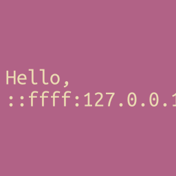

+++
title = "avatar.png"
description = "Dynamically generating PNGs with your IP address in them."
url = "posts/avatar.png"
date = 2023-12-31T04:56:00-08:00
[taxonomies]
tags = ["Rust", "PHP", "Networking", "webdev", "PNG"]
+++

No, not that Avatar. And not the other one either. This post is about
`avatar.png`, a handful of lines of PHP that have inspired me for a long time.

Around 2011 or 2012 a friend of mine, [Andrew Kvalheim][andrew_kvalheim], blew
my mind when he made his Skype profile picture display the IP address of the
computer I was using. It might have looked a bit like this.

<!-- more -->

<div style="display: flex; align-items: center; justify-content: center;">
  
</div>

We were both working at our university's IT help desk and I think Skype for
Business had just been rolled out to employees. If memory serves the
application let you upload a profile picture or give a URL for one. The image
was always fetched by the client, which made it possible to display a different
image to each person viewing your profile picture.

For me this was practically magic. I was fairly early in my programming
education at that point, so it took me a long time to really understand what
was going on.

The web server was serving a file named `avatar.png`. When viewed in a browser
you got a PNG containing your IP address, but when you opened the file itself
in a text editor it was PHP! How could one file be two different things
depending on how you looked at it?

I later learned that file extensions are mostly a suggestion and that with
enough creativity you can make computers to do a lot of fun things. That file
_can_ be two things at once, it just depends on your point of view.

Reflecting on the inspiration I've gotten from this simple program, I've spent
a bit of time translating `avatar.png` from PHP to Rust. I learned way more
than I bargained for in the process. Hopefully you'll learn something too as
you read this.

# PHP

Here is the original PHP which generated `avatar.png`. Judging by when this was
written I think it probably would have run on PHP 5.3 or 5.4.

```php
<?php

    //Get IP address
    $ip = explode('.', $_SERVER['REMOTE_ADDR'], 4);

    //Render image
    $image = @imagecreate(256, 256)
        or die("Cannot Initialize new GD image stream");
    $background_color = imagecolorallocate($image, 119, 41, 83);
    $text_color = imagecolorallocate($image, 255, 255, 255);
    imagettftext($image, 24, 0, 8, 96, $text_color, 'UbuntuMono-Regular.ttf', "Hello, \n$ip[0].$ip[1].$ip[2].$ip[3]!");

    //Send response
    header('Content-Type: image/png');
    imagepng($image);
    imagedestroy($image);
?>
```

In case you're not overly familiar with PHP, here's a quick rundown on what's happening there.

- [`$_SERVER`][server] &mdash; An array containing a bunch of information about
  the server and its environment. The `REMOTE_ADDR` element has
  > The IP address from which the user is viewing the current page. 

- [`explode`][explode] &mdash; Splits a string up by some separator. I can't
  find official docs, but Reddit has some [thoughts][explode_why] about the odd
  name.

- [`imagecreate`][imagecreate] &mdash; Part of the ["Graphics Draw"][gd]
  library. Creates a new [`GdImage`][gdimage] object. The [`@`][at_sigil] sigil
  in front of this call is for error suppression.

- [`die`][die] &mdash; PHP refuses to have normal names. Equivalent to
  [`exit`][exit], which I think exits the whole process. Docs discussion leads
  me to believe this is disastrous for the client.

- [`imagecolorallocate`][imagecolorallocate] &mdash; Allocate an RGB color for
  an image. What it means to "allocate" a color is never clarified, but the
  docs do say
  > The first call to `imagecolorallocate()` fills the background color...

- [`imagettftext`][imagettftext] &mdash; Write text to the image using
  [TrueType] fonts. Interestingly this appears to read the `.ttf` file from
  disk on every single request. 😬

- [`header`][header] &mdash; Send a raw [HTTP header][http_header].
  Importantly, this
  > ... must be called before any actual output is sent ...

  So, don't mess up that order!

- [`imagepng`][imagepng] &mdash; Output a PNG image. Returns `true` on success
  and `false` otherwise. Somehow magically streams the image to the client in
  between.

- [`imagedestroy`][imagedestroy] &mdash; This used to free any memory
  associated with the `GdImage` object, but these days it doesn't do anything
  at all.

I want to note that while reading the PHP docs I discovered that a
significant amount of this code overlaps with the [first `imagecreate`
example][imagecreate_example]. I think this showcases the benefits of quickly
copying what you need and adapting it to your purposes. As we become more
experienced software engineers we often over-engineer the heck out of things
(that's half of what this post is about). But there's real joy in just grabbing
what you find and using it as-is, especially for low-stakes fun.

# Rust

`Ok`. Now that we understand the PHP well enough to translate it, let's set
some ground rules.

1. I like it when blog posts build up solutions, showing mistakes and oddities
   on the way. If you want to skip all that, here's
   [the finished product](#the-finished-product).

2. I assume a basic level of Rust understanding. I don't expect you to have
   read [The Book] cover to cover, but I'll skip over many explanations.

3. As I translate this, keep in mind that PHP is a language made for the web.
   I'm not competing for brevity and certainly not trying to play [code golf].
   The Rust code **WILL** be longer.

4. I'll cut some corners in the initial implementation for the sake of
   understanding, but try to tidy things up by the end.

## Choosing A Framework

The original PHP was likely run in [Apache] using [mod_php], which appears to
be out of style these days. In Rust we don't necessarily run a separate server
like Apache or [Nginx]. Instead the application and server are compiled into
the same binary and we choose between frameworks. I've been enjoying [Axum]
lately, so that's what I used, but I'm sure [Actix] or [Rocket] would have been
fine too.

First, we create a new Rust project and add our dependencies.

```bash
$ cargo new avatar && cd avatar
$ cargo add axum@0.7.3
$ cargo add tokio@1.35.1 --features=rt-multi-thread,macros
```

Then, we add Axum's ["Hello, World!"][hello_world] example to `src/main.rs` and
build up from there.

```rust
use axum::{routing::get, Router};

#[tokio::main]
async fn main() {
    let app = Router::new().route("/", get(|| async { "Hello, World!" }));

    let listener = tokio::net::TcpListener::bind("0.0.0.0:3000").await.unwrap();
    axum::serve(listener, app).await.unwrap();
}
```

## Getting the IP

Going off the PHP example, the first thing to do is replicate the behavior of
`$_SERVER['REMOTE_ADDR']` and get the IP address of the client connecting to
the server. PHP [automagically] populates `$_SERVER` with this information, but
Axum wants us to be clear about our needs, so this gets a bit more complicated
right away.

```rust
use axum::{extract::ConnectInfo, routing::get, Router};
use std::net::SocketAddr;

#[tokio::main]
async fn main() {
    let app = Router::new().route(
        "/",
        get(|ConnectInfo(addr): ConnectInfo<SocketAddr>| async move {
            format!("Hello,\n{}!", addr.ip())
        }),
    );

    let listener = tokio::net::TcpListener::bind("0.0.0.0:3000").await.unwrap();
    let make_service = app.into_make_service_with_connect_info::<SocketAddr>();
    axum::serve(listener, make_service).await.unwrap();
}
```

Axum also exposes connection information, but not quite as automagically. This
information is given to a [handler] (the [closure] we give to
[`get`][axum_routing_get]) via an [extractor]. If that all sounds very
abstract, it's because it is.

Specifically, we use the [`ConnectInfo<T>`][axum_extract_connectinfo] extractor
as an argument to our closure and destructure it to get a
[`SocketAddr`][socket_addr] (the desired `T`). These types can't be inferred,
so our handler arguments get a bit verbose. This extractor also requires we
create our app using
[`into_make_service_with_connect_info<C>`][into_make_service_with_connect_info]
, which is a long way of saying "let my app get connection info". That behavior
is not enabled by default.

Astute readers will have noticed that we also added the [`move`][move] keyword
to our [`async` block][async_block]. Without this our friendly compiler
steps in to give a lecture on [borrowing and ownership].

<pre style="background:#282828;color:#fdf4c1aa"><code><span><span style="color:#fa5c4b">error[E0373]</span>: async block may outlive the current function, but it borrows `addr`, which is owned by the current function
</span><span>  <span style="color:#458588">--&gt;</span> src/main.rs:8:58
</span><span>   <span style="color:#458588">|</span>
</span><span><span style="color:#458588">8  |</span>           get(|ConnectInfo(addr): ConnectInfo&lt;SocketAddr&gt;| async {
</span><span>   <span style="color:#458588">|</span>  <span style="color:#fa5c4b">__________________________________________________________^</span>
</span><span><span style="color:#458588">9  |</span> <span style="color:#fa5c4b">|</span>             format!("Hello,\n{}!", addr.ip())
</span><span>   <span style="color:#458588">|</span> <span style="color:#fa5c4b">|</span>                                   <span style="color:#458588">---- `addr` is borrowed here</span>
</span><span><span style="color:#458588">10 |</span> <span style="color:#fa5c4b">|</span>         }),
</span><span>   <span style="color:#458588">|</span> <span style="color:#fa5c4b">|_________^ may outlive borrowed value `addr`</span>
</span><span>   <span style="color:#458588">|</span>
</span><span><span style="color:#98971a">note</span>: async block is returned here
</span><span>  <span style="color:#458588">--&gt;</span> src/main.rs:8:58
</span><span>   <span style="color:#458588">|</span>
</span><span><span style="color:#458588">8  |</span>           get(|ConnectInfo(addr): ConnectInfo&lt;SocketAddr&gt;| async {
</span><span>   <span style="color:#458588">|</span>  <span style="color:#98971a">__________________________________________________________^</span>
</span><span><span style="color:#458588">9  |</span> <span style="color:#98971a">|</span>             format!("Hello,\n{}!", addr.ip())
</span><span><span style="color:#458588">10 |</span> <span style="color:#98971a">|</span>         }),
</span><span>   <span style="color:#458588">|</span> <span style="color:#98971a">|_________^</span>
</span><span><span style="color:#83a598">help</span>: to force the async block to take ownership of `addr` (and any other referenced variables), use the `move` keyword
</span><span>   <span style="color:#458588">|</span>
</span><span><span style="color:#458588">8  |</span>         get(|ConnectInfo(addr): ConnectInfo&lt;SocketAddr&gt;| async <span style="color:#98971a">move</span> {
</span><span>   <span style="color:#458588">|</span>                                                                <span style="color:#98971a">++++</span>
</span><span>
</span><span>For more information about this error, try `rustc --explain E0373`.
</span></code></pre>

The closure we've written captures `addr` by reference because `addr.ip()`
borrows `self`. However, because the return of that closure is the whole
`async` block, itself a [`Future`][future], that reference is immediately invalidated.
Thankfully the compiler warns us and tells us what to do. So helpful! 😎 The
`move` gives ownership of `addr` to the returned `Future`.

The other way to get around this is to make our handler a function instead of a
closure.

```rust
async fn avatar(ConnectInfo(addr): ConnectInfo<SocketAddr>) -> String {
    format!("Hello,\n{}", addr.ip())
}
```

This also makes our app declaration prettier, so let's go with that.

```rust
let app = Router::new().route("/avatar.png", get(avatar));
```

Notice that we also changed the route to `/avatar.png` to match how the PHP
was served. We can verify this works as intended with `curl`.

```bash
$ curl http://localhost:3000/avatar.png
Hello,
127.0.0.1!
```

## Creating a PNG

Unfortunately, the assignment wasn't to return the client's IP address in
plaintext. For parity with the PHP we need to serve an image. Fortunately, the
[image] crate exists.

```bash
$ cargo add image@0.24.7
```

### Background

The image crate allows us to create a PNG in a fashion similar to the PHP. The
analog of `@imagecreate` is to create an [`ImageBuffer`][image_buffer]. Instead
of `imagecolorallocate`, the `ImageBuffer` struct has a convenient
[`from_pixel`][image_buffer_from_pixel] method which allows us to specify a
starting pixel that is then copied across our new canvas. We can start with a
single [`Rgb`][image_rgb] pixel.

```rust
use image::{ImageBuffer, Rgb};

const WIDTH: u32 = 256;
const HEIGHT: u32 = WIDTH;
const BACKGROUND_COLOR: Rgb<u8> = Rgb([177, 98, 134]);

// ...

let img = ImageBuffer::from_pixel(WIDTH, HEIGHT, BACKGROUND_COLOR);
```

### File Format

The resulting image buffer is not yet an image though. It's pretty much still a
multi-dimensional array of integers. To construct a PNG someone can actually
see we need to jam those integers into the [PNG file format]. Sadly for us, the
equivalent of PHP's `imagepng` is nowhere near as convenient.

If you use `ImageBuffer`'s [`save`][image_buffer_save] method to write the
buffer out as a file

```rust
img.save("avatar.png").unwrap();
```

you'll get a blank canvas like this.

<div style="display: flex; align-items: center; justify-content: center;">
  
</div>

Sure enough, that's a PNG, but using `save` is disastrous to us for a few
reasons.

- The image is written to the filesystem. To serve its contents to the client
   we'd have to read it from disk, which is **SLOW**.

-  Even if it wasn't slow we'd have concurrency issues. Clients could encounter
   half-written images or incorrect IP addresses from other clients.

- Even if the above weren't issues, the `save` method is written to assume
   synchronous I/O and Axum is an asynchronous web framework. We'd need to
   spawn a [background task][spawn_blocking] to keep it from blocking others.

Instead, `ImageBuffer` has a [`write_to`][image_buffer_write_to] method which
> [w]rites the buffer to a writer in the specified format.

In this case a "writer" is some type, `W`, which implements the
[`Write`][write] and [`Seek`][seek] traits. Rust's standard library gives us
such a `W` in the form of [`std::io::Cursor<T>`][cursor]. We can use a
[`Vec<u8>`][vec] for our cursor's buffer type, `T`.

```rust
let mut cursor = Cursor::new(vec![]);
```

As for the "specified format", `save` has some logic to infer output format
from file extension, but with `write_to` we can just pass
[`ImageOutputFormat::Png`][image_output_format_png].

```rust
img.write_to(&mut cursor, ImageOutputFormat::Png).unwrap();
```

The `Vec<u8>` wrapped by our cursor now contains all the bytes for a proper
(albeit blank) PNG. We can work with that `Vec<u8>` directly by consuming the
cursor with [`into_inner`][cursor_into_inner].

### Serving the Image

At this point we need to tell Axum how to serve the image we've created. How do
we turn a `Vec<u8>` into a response that a client will understand as an image?

Axum knows how to serve `Vec<u8>` out of the box, but if we change the
handler's signature to return just that we'll have undesired behavior.

```rust
async fn avatar(ConnectInfo(addr): ConnectInfo<SocketAddr>) -> Vec<u8> {
    // ..
    cursor.into_inner()
}
```

Check that with `curl` and you'll see a response like

```bash
$ curl --head http://localhost:3000/avatar.png
HTTP/1.1 200 OK
content-type: application/octet-stream
content-length: 1726
date: Thu, 28 Dec 2023 02:30:17 GMT
```

Note that the `Content-Type` header is
[`application/octet-stream`][application_octet_stream] and **not**
[`image/png`][image_png]. We need analogs for PHP's `header` and `imagepng` in
order to tell the client the response is a PNG.

We could build an appropriate [`Response`][http_response] ourselves, but the
magic of Axum's [`IntoResponse`][axum_into_response] trait provides a clear,
terse syntax for this that I find preferable.

```rust
async fn avatar(ConnectInfo(addr): ConnectInfo<SocketAddr>) -> impl IntoResponse {
    // ...
    ([(header::CONTENT_TYPE, "image/png")], cursor.into_inner())
}
```

We return a tuple with an array mapping header names to values and the bytes
for the body. Axum's [blanket implementations] for `IntoResponse` do all the
work to figure out how to turn that into an HTTP response.

Putting it all together our current handler looks like this.

```rust
async fn avatar(ConnectInfo(addr): ConnectInfo<SocketAddr>) -> impl IntoResponse {
    let _text = format!("Hello,\n{}", addr.ip());
    let img = ImageBuffer::from_pixel(WIDTH, HEIGHT, BACKGROUND_COLOR);

    let mut cursor = Cursor::new(vec![]);
    img.write_to(&mut cursor, ImageOutputFormat::Png).unwrap();

    ([(header::CONTENT_TYPE, "image/png")], cursor.into_inner())
}
```

The `_text` is notably being ignored right now. We can get IP addresses, we
can create PNGs, and we can serve them. Now what remains is to put the text in
the image.

### Adding Text

For the Rust analog of PHP's `imagettftext` we need a way to draw text on our
image. The `image` crate doesn't provide any routines for manipulating text,
but it does recommend the [`imageproc`][imageproc] crate, which is maintained
by the same organization.

```bash
$ cargo add imageproc@0.23.0
```

This crate provides a [`draw_text_mut`][draw_text_mut] function, which will
draw text onto an existing image. From its signature we can gather it needs a
whopping 7 arguments (PHP's `imagettftext` is 8, so maybe I shouldn't
complain). Naturally, these aren't really documented, but we can learn a lot
from Rust signatures alone.

- `canvas` &mdash; Any type that implements `imageproc`'s
  [`Canvas`][imageproc_drawing_canvas] trait.
- `color` &mdash; Any [`Pixel`][image_pixel] which can be drawn on that
  `canvas`.
- `x` &mdash; The x-coordinate at which to start drawing the text.
- `y` &mdash; The y-coordinate at which to start drawing the text.
- `scale` &mdash; The [`Scale`][rusttype_scale] of the font face used when
  drawing the text.
- `font` &mdash; The [`Font`][rusttype_font] the text should be drawn in.
- `text` &mdash; The text itself.

That feels like a lot, but we already have most of what we need. Luckily our
existing `ImageBuffer` satisfies the `Canvas` trait and we already know it's
using `Rgb` pixels which satisfy the `Pixel` trait. The `x` and `y` coordinates
were given in the original PHP and we already have our `_text`. We only need a
`Scale` and a `Font`. To work with both we'll need the [`rusttype`][rusttype]
crate.

```bash
$ cargo add rusttype@0.9.3
```

#### Getting a Font

The font used in the original PHP was [Ubuntu Mono][ubuntu_mono], which is
freely available for download. We just need to put the file alongside our Rust
code.

In PHP-land with `imagettftext` we just specified the path to a TrueType font
file (`UbuntuMono-Regular.ttf`) and went on our merry way. Our Rust libraries
want us to create a `Font`, which requires us to load the contents of that
font file into our application.

We could do this on every request, which I think is what the PHP does. Or, we
could do one better and bake the font directly into our application with Rust's
[`include_bytes!`][include_bytes] macro. I threw in the [`concat!`][concat] and
[`env!`][env] macros as well for completeness.

```rust
const FONT_DATA: &[u8] = include_bytes!(concat!(
    env!("CARGO_MANIFEST_DIR"),
    "/fonts/UbuntuMono-R.ttf"
));

// ...

let font = Font::try_from_bytes(FONT_DATA).unwrap();
```

Unfortunately, while the `FONT_DATA` can be [`const`][const] the `Font` itself
can't, but we can work with this for now.

#### Setting a Scale

The last piece of information we need to draw text is a font `Scale`. According
to the docs the scale is defined in [pixels][pixel]. However, PHP's
`imagettftext` specifies a size in [points][point]. The difference between
pixels and points is a [tricky business][points_vs_pixels], but for our
purposes we can take the _Easy Mode_ ™ route by assuming that a point is
defined at a 3:4 ratio to a pixel. Thus, from the original font size of `24` we
arrive at a scale of `32`.

```rust
const SCALE: Scale = Scale { x: 32.0, y: 32.0 };
```

#### Putting It All Together

With `Font`, `Scale`, and all our other arguments in hand we can finally draw
text on the image.

```rust
const X: i32 = 8;
const Y: i32 = 96;
const WIDTH: u32 = 256;
const HEIGHT: u32 = WIDTH;
const TEXT_COLOR: Rgb<u8> = Rgb([235, 219, 178]);
const BACKGROUND_COLOR: Rgb<u8> = Rgb([177, 98, 134]);
const SCALE: Scale = Scale { x: 32.0, y: 32.0 };
const FONT_DATA: &[u8] = include_bytes!(concat!(
    env!("CARGO_MANIFEST_DIR"),
    "/fonts/UbuntuMono-R.ttf"
));

async fn avatar(ConnectInfo(addr): ConnectInfo<SocketAddr>) -> impl IntoResponse {
    let text = format!("Hello,\n{}", addr.ip());
    let font = Font::try_from_bytes(FONT_DATA).unwrap();
    let mut img = ImageBuffer::from_pixel(WIDTH, HEIGHT, BACKGROUND_COLOR);
    draw_text_mut(&mut img, TEXT_COLOR, X, Y, SCALE, &font, &text);

    let mut cursor = Cursor::new(vec![]);
    img.write_to(&mut cursor, ImageOutputFormat::Png).unwrap();

    ([(header::CONTENT_TYPE, "image/png")], cursor.into_inner())
}
```

That handler will get us an image that looks something like this.

<div style="display: flex; align-items: center; justify-content: center;">
  
</div>

Which... doesn't really look right, does it? What the heck is the `□` and why
is the IP address cut off instead of being on a [new line][newline]?

#### Handling Newlines

We find the answer, as we often do, by reading more closely. `draw_text_mut`'s
docs clearly say

> Note that this function _does not_ support newlines, you must do this
> manually.

That also offers an explanation for what the `□` is. By digging into the
`imageproc` source we can see that it ultimately calls
[`Font::glyph`][font_glyph], which says

> Note that code points without corresponding glyphs in this font map to the
> “.notdef” glyph, glyph 0.

Since the newline character `\n` is a [control character][control_character]
it's not in the font itself and thus we get the [.notdef][notdef] glyph
instead. This also explains why the `rusttype` crate (and by extension
`imageproc`) doesn't support newlines.

So how can we "do this manually"? Neither `imageproc` nor `rusttype` offer any
specific advice. The easiest approach seems to be to just split the text up
ourselves and draw what goes on the next line with a new `y` offset.

```rust
    let ip = addr.ip();
    draw_text_mut(&mut img, TEXT_COLOR, X, Y, SCALE, &font, "Hello,");
    let y = Y + SCALE.y as i32;
    draw_text_mut(&mut img, TEXT_COLOR, X, y, SCALE, &font, &format!("{ip}!"));
```

I chose to just add `SCALE.y` to the original `Y`, which is playing fast and
loose with concepts like [line height][leading], but seems to work out well
enough. At last, we can reproduce the original PHP with output that looks
something like this.

<div style="display: flex; align-items: center; justify-content: center;">
  
</div>

## Room for Improvement

I've not gone back and run an old Apache instance, so I can't say with 100%
certainty that we've got a pixel perfect replica of the original, but I think
it's darn close. There's still more to think about though. Here's a grab bag of
potential improvements, some I've made and some I've saved for another day.

### Using One `Font`

Earlier I mentioned that our `Font` couldn't be `const`. That's true, but with
a little effort it can at least be `static`. I don't always love globals, but
it feels silly to create a new `Font` on each request when it could be the same
darn font every time.

I initially thought to use the [`lazy_static`][lazy_static] crate for this
purpose, but since Rust 1.70.0 stablized [`OnceLock`][oncelock] I thought I'd
give that a try. Why not use a standard library approach if you can?

Until [`LazyLock`][lazylock] stablizes it seems like the most ergonomic use of
`OnceLock` for what we want involves creating an accessor function.

```rust
use std::sync::OnceLock;

fn font() -> &'static Font<'static> {
    static FONT: OnceLock<Font> = OnceLock::new();
    FONT.get_or_init(|| Font::try_from_bytes(FONT_DATA).expect("Built-in font data was invalid"))
}
```

At the call site we just swap a `&font` for a `font()` and we're done. One
`Font`.

Normally I avoid potential [panic][panic]s as much as I can, but the only way
that [`Font::try_from_bytes`][font_try_from_bytes] can fail is if the `.ttf`
file is invalid at compile time, so I felt comfortable using
[`expect`][expect].

### Error Handling

Yeah, the PHP just uses `or die`, but this is Rust, so we should try harder.

A panic in a completely unrecoverable situation which indicates your software
was built wrong seems acceptable for now, but we should fix all of our
[`unwrap`][unwrap] calls. While not strictly necessary, it helps to have good
supporting libraries.

```bash
$ cargo add anyhow@1.0.78
$ cargo add thiserror@1.0.53
```

#### Server Errors

The `unwrap`s in `main` can be neatly [`?`][question_mark]'d out of existence
with [`anyhow`][anyhow] and [`Result` in `main`][result_in_main]. If they
fail the program can't reasonably continue, but we should try to exit cleanly
and allow an admin to read _something_ about what happened.

```rust
#[tokio::main]
async fn main() -> anyhow::Result<()> {
    let app = Router::new().route("/avatar.png", get(avatar));

    let listener = tokio::net::TcpListener::bind("0.0.0.0:3000").await?;
    let make_service = app.into_make_service_with_connect_info::<SocketAddr>();
    axum::serve(listener, make_service).await?;
    Ok(())
}
```

#### Handler Errors

The remaining `unwrap` in `avatar` benefits from a more careful approach. If
converting one `ImageBuffer` into a `Vec<u8>` fails for a single request the
whole application shouldn't crash. This failure point comes from

```rust
img.write_to(&mut cursor, ImageOutputFormat::Png).unwrap();
```

The `write_to` method returns a [`Result<T, E>`][result] whose `E` is an
[`ImageError`][imageerror]. Unfortunately, it's not quite as simple as
returning `Result<impl IntoResponse, image::ImageError>` from our handler.
Trying to do so yields a rare and disappointing mystery compilation error too
long to reproduce here.

After sleuthing in Axum's [error handling docs][axum_error_handling] you can
discover that the `Err` variant for a `Result` should implement `IntoResponse`
itself. Frustratingly, our application code owns neither the `ImageError`
type nor the `IntoResponse` trait, so Rust's [orphan rules][orphan_rules]
prevent us from implementing this directly ourselves. The easiest solution is
to make a wrapper.

```rust
#[derive(Debug, thiserror::Error)]
#[error("Failed to generate image: {0}")]
struct AvatarError(#[from] image::ImageError);
```

The [`thiserror`][thiserror] crate makes this blessedly straightforward. An
`AvatarError` wraps an `ImageError` and can automatically be converted from one
thanks to the ease of `#[from]`.

```rust
impl IntoResponse for AvatarError {
    fn into_response(self) -> axum::response::Response {
        (StatusCode::INTERNAL_SERVER_ERROR, self.to_string()).into_response()
    }
}
```

Having to implement this trait for our own error makes a little more sense now.
Without it how could Axum have known that this particular error should be an
[Internal Server Error]?

Now we're allowed to define our handler as

```rust
async fn avatar(
    ConnectInfo(addr): ConnectInfo<SocketAddr>,
) -> Result<impl IntoResponse, AvatarError> {
    // ...
}
```

and we can use `?` just like we hoped to.

### IPv6 Support

Until now we've assumed that everything is using [IPv4], but it's the tail end
of 2023, so we should probably at least think about [IPv6]. Unfortunately
things get ugly in a hurry.

In fairness though, I'm not sure how well the original PHP's

```php
<?php
    $ip = explode('.', $_SERVER['REMOTE_ADDR'], 4);
?>
```

handled IPv6, so this is well off the beaten path.

#### Allowing IPv6 Connections

With what's been written so far if you try to make an IPv6 connection you're
gonna have a bad time.

```bash
$ curl -6 http://localhost:3000/avatar.png  
curl: (7) Failed to connect to localhost port 3000: Connection refused
```

This is because we told the server to listen on
[`0.0.0.0`][ipv4_zeros] as a special shorthand for "listen on
all network interfaces". `0.0.0.0` is specific to IPv4, so we aren't listening
for any incoming IPv6 connections. We can fix that by listening on
[`::`][ipv6_zeros], the IPv6 equivalent.

```rust
let listener = tokio::net::TcpListener::bind("[::]:3000").await?;
```

I've wrapped the `::` with `[]` because it helps readability by disambiguating
between `:` as part of the address and `:` as an address/port separator. Also
because [RFC 2732] said so.

Listening on an IPv6 fixes the problem and also still works for IPv4...
[kinda][semantics_of_zeros_in_dual_stack_oses]... Apparently the exact
semantics are OS-dependent. On Windows it only binds for IPv6 and on Linux it's
dependent on kernel configuration.

I _think_ in order to make it work in both Windows and Linux you'd have to

- Listen on `::`.
- _Also_ listen on `0.0.0.0`.
- Spawn two [tasks][task], each with their own copy of the app, and put
  them in a [`JoinSet`][joinset].
- Hope and pray (or check) that `/proc/sys/net/ipv6/bindv6only` is set,
  otherwise Linux will get mad at you because it's _already_ listening on both.

I couldn't be bothered. I'd choose to run the application on Linux and I
control the kernel, so it's working for me. 🤷‍♂️

#### Displaying IPv4 Correctly

Just because we can accept IPv4 and IPv6 connections doesn't mean it's actually
working the way we want it to though. Letting `::` bind both IPv4 and IPv6 has
another side effect. IPv4 addresses are interpeted as [IPv4-mapped IPv6
addresses][ipv4_mapped_ipv6_addresses].

If you `curl` via IPv4 specifically with

```bash
$ curl -4 -O http://localhost:3000/avatar.png  
```

you're likely to see something like this.

<div style="display: flex; align-items: center; justify-content: center;">
  
</div>

In this form an IPv4 address like `127.0.0.1` is represented in an IPv6 address
format like `::ffff:127.0.0.1`. The IPv4 form is the "canonical" form. Luckily
Rust's [`IpAddr`][ipaddr] type has a method for this,
[`to_canonical`][to_canonical].

```rust
let ip = addr.ip().to_canonical();
```

This was actually just added in [Rust 1.75.0][rust_1_75_0] mere days ago, well
after I started writing this. You can just take my word that this was rather
more of a pain in the ass to deal with before that.

IPv4 works again!

<div style="display: flex; align-items: center; justify-content: center;">
  
</div>

IPv6 also works!

<div style="display: flex; align-items: center; justify-content: center;">
  
</div>

Haha, just kidding, it absolutely does not. Most IPv6 addresses are way longer
than `::1`.

<div style="display: flex; align-items: center; justify-content: center;">
  
</div>

#### Displaying IPv6 Correctly

Out of all the problems we've dealt with so far I think this is the thorniest.
Unlike with the [newline issue](#handling-newlines), the text simply doesn't
fit in the image. At this font size, if you get a real-world
IPv6 address you're more than likely going to draw it right off the edge of the
canvas.

Just decrease the font size, you might say...

<div style="display: flex; align-items: center; justify-content: center;">
  
</div>

Your eyes must be better than mine. That's not easy to read. I had to set the
`Scale` to `12.0` to make that fit. It looks even sillier with `::1`, I
promise.

OK, well just make the PNG wider then!

<style>
/* Allow scrolling the image overflow on mobile devices. */
.wide-boi { display: flex; align-items: center; justify-content: center; overflow: auto; }
@media(max-width: 700px) { .wide-boi { justify-content: left; } }
</style>
<div class="wide-boi">
  
</div>

Cool, now it's `648` pixels wide. If you're reading on mobile it might well
exceed the width of your screen. It _also_ looks silly with `::1`, btw.
Additionally, it likely violates an original constraint that the image be 256 x
256 pixels to serve as a profile picture.

Uhh... why are you making this so complicated? We did newlines before, wrap the text!

<div style="display: flex; align-items: center; justify-content: center;">
  
</div>

Huh. Actually, I don't hate that, but it no longer looks centered. Also, IPv6
addresses aren't guaranteed to have a uniform length. There are
[several different ways to represent them][ipv6_representation]. For example,
`2001:0db8:0000:0000:0000:8a2e:0370:7334` can also be written as
`2001:db8::8a2e:370:7334`. Furthermore, [RFC 5952] recommends that

> Leading zeros MUST be suppressed.

and

> The use of the symbol "::" MUST be used to its maximum capability.

so if we play by the rules different addresses might take up a different number
of lines. Really, both width and height could be variable depending on our
solution.

#### Is There Nothing We Can Do?

We've considered 3 solutions, all of which have their own issues.

1. Shrinking the font size.
   - Mostly illegible.
2. Increasing the image width.
   - Looks awkward for variable width addresses.
   - Likely violates an original constraint for 256 x 256 pixels.
3. Wrapping the text.
   - Looks awkward for variable lines.

Of the 3 solutions I think text wrapping is the most appropriate, but I ran out
of time to pursue an implementation before writing this. I feel comfortable
leaving a solution as an exercise to the reader and would love to hear what
others would do.

### SVG

I'm sure that by now at least one person has been screaming "Use [SVG][svg]!"
in their mind. Personally, I'm not convinced it's necessarily a better fit, but
it's not something I know much about, so I'm open to being wrong.

I applied what little I know to create an SVG.

```svg
<svg width="256" height="256" xmlns="http://www.w3.org/2000/svg">
  <style>
  @font-face {
    font-family: "Ubuntu Mono";
    src: url(/fonts/UbuntuMono-Regular.ttf) format('truetype');
  }
  </style>
  <rect width="100%" height="100%" fill="#b16286"/>
  <text x="8" y="96" font-size="24" font-family="Ubuntu Mono" fill="#ebdbb2">
    <tspan x="0" dy="1em">Hello,</tspan>
    <tspan x="0" dy="1em">127.0.0.1!</tspan>
  </text>
</svg>
```

I left the font out for this particular image, but it yields something like
this.

<div style="display: flex; align-items: center; justify-content: center;">
<svg width="256" height="256" xmlns="http://www.w3.org/2000/svg">
  <rect width="100%" height="100%" fill="#b16286"/>
  <text x="8" y="96" font-size="24" font-family="monospace" fill="#ebdbb2">
    <tspan x="0" dy="1em">Hello,</tspan>
    <tspan x="0" dy="1em">127.0.0.1!</tspan>
  </text>
</svg>
</div>

Here are my observations given what I assume about SVGs, PNGs, and this
problem.

#### Benefits

- The font looks smoother as a vector graphic than in a raster image when zoomed in.
- The SVG above is all of 435 bytes for the client to download.
- Supports font fallback if the font can't be downloaded.
- You can copy the text out of it!

#### Downsides

- The SVG might be 435 bytes, but the `.ttf` file is ~205KB. Most PNGs in this
  post are <10KB.
- Neither newlines nor line wrapping in general appear to be solved, at least
  not in [`text`][text].
- Likely would not have been supported by the original target client.

I don't see the benefits hugely outweighing the downsides, especially when
keeping in mind what likely would have been the original constraints. What
we've got should do for now.


## The Finished Product

I can't believe you read this far. The final code is available on
[GitHub][avatar_png_github], but this post didn't feel complete without putting
everything I talked about in one place for comparision with the [PHP](#php).

It's significantly longer than the original and probably more complicated than
it needs to be, but it mostly works and that's worth something.

```rust
use std::{io::Cursor, net::SocketAddr, sync::OnceLock};

use axum::{
    extract::ConnectInfo,
    http::{header, StatusCode},
    response::IntoResponse,
    routing::get,
    Router,
};
use image::{ImageBuffer, ImageOutputFormat, Rgb};
use imageproc::drawing::draw_text_mut;
use rusttype::{Font, Scale};

const X: i32 = 8;
const Y: i32 = 96;
const WIDTH: u32 = 256;
const HEIGHT: u32 = WIDTH;
const TEXT_COLOR: Rgb<u8> = Rgb([235, 219, 178]);
const BACKGROUND_COLOR: Rgb<u8> = Rgb([177, 98, 134]);
const SCALE: Scale = Scale { x: 32.0, y: 32.0 };
const FONT_DATA: &[u8] = include_bytes!(concat!(
    env!("CARGO_MANIFEST_DIR"),
    "/fonts/UbuntuMono-R.ttf"
));

#[derive(Debug, thiserror::Error)]
#[error("Failed to generate image: {0}")]
struct AvatarError(#[from] image::ImageError);

impl IntoResponse for AvatarError {
    fn into_response(self) -> axum::response::Response {
        (StatusCode::INTERNAL_SERVER_ERROR, self.to_string()).into_response()
    }
}

fn font() -> &'static Font<'static> {
    static FONT: OnceLock<Font> = OnceLock::new();
    FONT.get_or_init(|| Font::try_from_bytes(FONT_DATA).expect("Built-in font data was invalid"))
}

async fn avatar(
    ConnectInfo(addr): ConnectInfo<SocketAddr>,
) -> Result<impl IntoResponse, AvatarError> {
    // Wow, IPv6 causes a lot of headache. 😵‍💫
    let ip = addr.ip().to_canonical();
    let mut img = ImageBuffer::from_pixel(WIDTH, HEIGHT, BACKGROUND_COLOR);

    draw_text_mut(&mut img, TEXT_COLOR, X, Y, SCALE, font(), "Hello,");
    let y = Y + SCALE.y as i32;
    draw_text_mut(&mut img, TEXT_COLOR, X, y, SCALE, font(), &format!("{ip}!"));

    let mut cursor = Cursor::new(vec![]);
    img.write_to(&mut cursor, ImageOutputFormat::Png)?;

    Ok(([(header::CONTENT_TYPE, "image/png")], cursor.into_inner()))
}

#[tokio::main]
async fn main() -> anyhow::Result<()> {
    let app = Router::new().route("/avatar.png", get(avatar));

    let listener = tokio::net::TcpListener::bind("[::]:3000").await?;
    let make_service = app.into_make_service_with_connect_info::<SocketAddr>();
    axum::serve(listener, make_service).await?;
    Ok(())
}
```

Thanks for reading! Maybe I'll learn to write smaller posts next year. 🤣

[andrew_kvalheim]: https://andrew.kvalhe.im/
[server]: https://www.php.net/manual/en/reserved.variables.server.php
[explode]: https://www.php.net/manual/en/function.explode.php
[explode_why]: https://www.reddit.com/r/lolphp/comments/mdkvzl/comment/gsafb5u/
[imagecreate]: https://www.php.net/manual/en/function.imagecreate.php
[gd]: https://www.php.net/manual/en/intro.image.php
[gdimage]: https://www.php.net/manual/en/class.gdimage.php
[at_sigil]: https://www.php.net/manual/en/language.operators.errorcontrol.php
[die]: https://www.php.net/manual/en/function.die.php
[exit]: https://www.php.net/manual/en/function.exit.php
[imagecolorallocate]: https://www.php.net/manual/en/function.imagecolorallocate.php
[imagettftext]: https://www.php.net/manual/en/function.imagettftext.php
[header]: https://www.php.net/manual/en/function.header.php
[http_header]: https://developer.mozilla.org/en-US/docs/Web/HTTP/Headers
[imagepng]: https://www.php.net/manual/en/function.imagepng.php
[imagedestroy]: https://www.php.net/manual/en/function.imagedestroy.php
[imagecreate_example]: https://www.php.net/manual/en/function.imagecreate.php#refsect1-function.imagecreate-examples
[point]: https://en.wikipedia.org/wiki/Point_(typography)
[The Book]: https://doc.rust-lang.org/book/
[code golf]: https://en.wikipedia.org/wiki/Code_golf
[Apache]: https://httpd.apache.org/
[mod_php]: https://cwiki.apache.org/confluence/display/httpd/PHP#PHP-Usingmod_phpasaDSO(legacy)
[Nginx]: https://nginx.org/en/
[Axum]: https://github.com/tokio-rs/axum
[Actix]: https://actix.rs/
[Rocket]: https://rocket.rs/
[hello_world]: https://en.wikipedia.org/wiki/%22Hello,_World!%22_program
[automagically]: https://en.wiktionary.org/wiki/automagical
[handler]: https://docs.rs/axum/0.7.1/axum/index.html#handlers
[closure]: https://doc.rust-lang.org/book/ch13-01-closures.html
[axum_routing_get]: https://docs.rs/axum/0.7.1/axum/routing/method_routing/fn.get.html
[extractor]: https://docs.rs/axum/0.7.1/axum/index.html#extractors
[axum_extract_connectinfo]: https://docs.rs/axum/0.7.1/axum/extract/struct.ConnectInfo.html
[socket_addr]: https://doc.rust-lang.org/std/net/enum.SocketAddr.html
[into_make_service_with_connect_info]: https://docs.rs/axum/0.7.1/axum/struct.Router.html#method.into_make_service_with_connect_info
[move]: https://doc.rust-lang.org/std/keyword.move.html
[async_block]: https://doc.rust-lang.org/reference/expressions/block-expr.html#async-blocks
[borrowing and ownership]: https://doc.rust-lang.org/book/ch04-00-understanding-ownership.html
[future]: https://doc.rust-lang.org/std/future/trait.Future.html
[curl]: https://curl.se/
[image]: https://crates.io/crates/image
[image_buffer]: https://docs.rs/image/0.24.7/image/struct.ImageBuffer.html
[image_buffer_from_pixel]: https://docs.rs/image/0.24.7/image/struct.ImageBuffer.html#method.from_pixel
[image_rgb]: https://docs.rs/image/0.24.7/image/struct.Rgb.html
[PNG file format]: https://en.wikipedia.org/wiki/PNG#File_format
[image_buffer_save]: https://docs.rs/image/0.24.7/image/struct.ImageBuffer.html#method.save
[spawn_blocking]: https://docs.rs/tokio/1.34.0/tokio/task/fn.spawn_blocking.html
[image_buffer_write_to]: https://docs.rs/image/0.24.7/image/struct.ImageBuffer.html#method.write_to
[write]: https://doc.rust-lang.org/std/io/trait.Write.html
[seek]: https://doc.rust-lang.org/std/io/trait.Seek.html
[cursor]: https://doc.rust-lang.org/std/io/struct.Cursor.html
[image_output_format_png]: https://docs.rs/image/0.24.7/image/enum.ImageOutputFormat.html#variant.Png
[vec]: https://doc.rust-lang.org/std/vec/struct.Vec.html
[cursor_into_inner]: https://doc.rust-lang.org/std/io/struct.Cursor.html#method.into_inner
[application_octet_stream]: https://www.iana.org/assignments/media-types/application/octet-stream
[image_png]: https://www.iana.org/assignments/media-types/image/png
[http_response]: https://docs.rs/http/1.0.0/http/response/struct.Response.html
[axum_into_response]: https://docs.rs/axum/0.7.1/axum/response/trait.IntoResponse.html
[blanket implementations]: https://users.rust-lang.org/t/what-are-blanket-implementations/49904
[imageproc]: https://docs.rs/imageproc/0.23.0/imageproc/index.html
[draw_text_mut]: https://docs.rs/imageproc/0.23.0/imageproc/drawing/fn.draw_text_mut.html
[imageproc_drawing_canvas]: https://docs.rs/imageproc/0.23.0/imageproc/drawing/trait.Canvas.html
[image_pixel]: https://docs.rs/image/0.24.7/image/trait.Pixel.html
[rusttype_scale]: https://docs.rs/rusttype/0.9.3/rusttype/struct.Scale.html
[rusttype_font]: https://docs.rs/rusttype/0.9.3/rusttype/enum.Font.html
[TrueType]: https://en.wikipedia.org/wiki/TrueType
[rusttype]: https://docs.rs/rusttype/0.9.3/rusttype/index.html
[ubuntu_mono]: https://design.ubuntu.com/font
[include_bytes]: https://doc.rust-lang.org/std/macro.include_bytes.html
[concat]: https://doc.rust-lang.org/std/macro.concat.html
[env]: https://doc.rust-lang.org/std/macro.env.html
[const]: https://doc.rust-lang.org/std/keyword.const.html
[pixel]: https://en.wikipedia.org/wiki/Pixel
[point]: https://en.wikipedia.org/wiki/Point_(typography)
[points_vs_pixels]: https://graphicdesign.stackexchange.com/questions/199/point-vs-pixel-what-is-the-difference
[newline]: https://en.wikipedia.org/wiki/Newline
[font_glyph]: https://docs.rs/rusttype/0.9.3/rusttype/enum.Font.html#method.glyph
[control_character]: https://en.wikipedia.org/wiki/Control_character
[notdef]: https://learn.microsoft.com/en-us/typography/opentype/spec/recom#glyph-0-the-notdef-glyph
[leading]: https://en.wikipedia.org/wiki/Leading
[lazy_static]: https://docs.rs/lazy_static/1.4.0/lazy_static/index.html
[oncelock]: https://doc.rust-lang.org/stable/std/sync/struct.OnceLock.html
[lazylock]: https://doc.rust-lang.org/std/sync/struct.LazyLock.html
[panic]: https://doc.rust-lang.org/std/macro.panic.html
[font_try_from_bytes]: https://docs.rs/rusttype/0.9.3/rusttype/enum.Font.html#method.try_from_bytes
[expect]: https://doc.rust-lang.org/std/option/enum.Option.html#method.expect
[unwrap]: https://doc.rust-lang.org/std/result/enum.Result.html#method.unwrap
[question_mark]: https://doc.rust-lang.org/std/result/#the-question-mark-operator-
[anyhow]: https://docs.rs/anyhow/1.0.77/anyhow/index.html
[result_in_main]: https://doc.rust-lang.org/reference/crates-and-source-files.html#main-functions
[result]: https://doc.rust-lang.org/std/result/enum.Result.html
[imageerror]: https://docs.rs/image/0.24.7/image/error/enum.ImageError.html
[axum_error_handling]: https://docs.rs/axum/0.7.1/axum/error_handling/index.html
[orphan_rules]: https://doc.rust-lang.org/reference/items/implementations.html#trait-implementation-coherence
[thiserror]: https://docs.rs/thiserror/1.0.52/thiserror/index.html
[Internal Server Error]: https://developer.mozilla.org/en-US/docs/web/http/status/500
[IPv4]: https://en.wikipedia.org/wiki/IPv4
[IPv6]: https://en.wikipedia.org/wiki/IPv6
[ipv4_zeros]: https://en.wikipedia.org/wiki/0.0.0.0
[ipv6_zeros]: https://en.wikipedia.org/wiki/0.0.0.0#In_IPv6
[RFC 2732]: https://datatracker.ietf.org/doc/html/rfc2732
[semantics_of_zeros_in_dual_stack_oses]: https://serverfault.com/questions/21657/semantics-of-and-0-0-0-0-in-dual-stack-oses/39561#39561
[task]: https://docs.rs/tokio/1.34.0/tokio/task/index.html
[joinset]: https://docs.rs/tokio/1.34.0/tokio/task/struct.JoinSet.html
[ipv4_mapped_ipv6_addresses]: https://en.wikipedia.org/wiki/IPv6#IPv4-mapped_IPv6_addresses
[ipaddr]: https://doc.rust-lang.org/std/net/enum.IpAddr.html
[to_canonical]: https://doc.rust-lang.org/std/net/enum.IpAddr.html#method.to_canonical
[rust_1_75_0]: https://blog.rust-lang.org/2023/12/28/Rust-1.75.0.html
[ipv6_representation]: https://en.wikipedia.org/wiki/IPv6#Address_representation
[RFC 5952]: https://datatracker.ietf.org/doc/html/rfc5952
[svg]: https://en.wikipedia.org/wiki/SVG
[text]: https://developer.mozilla.org/en-US/docs/Web/SVG/Element/tspan
[avatar_png_github]: https://github.com/reillysiemens/avatar/tree/ee21f6161d3ab64f40f9e6b762ff4d0c931d2ac9
