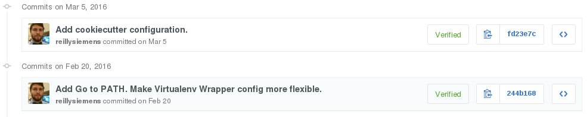

+++
title = "git filter-wat"
description = "Fighting git filter-branch and GPG."
url = "posts/git-filter-wat"
date = 2016-04-07T16:06:33-08:00
[taxonomies]
tags = ["GitHub", "PGP", "Git"]
+++
Welcome to this year's annual blog post!

I've been signing `git` commits for my [dotfiles] repository since its
inception in October of last year, so I was excited to see that GitHub recently
added [GPG signature verification]. All you have to do is upload your
[public key] to GitHub and you'll be verifying commits like a champ. Or so I
thought…

<!-- more -->

<figure>

<figcaption>
Unverified commits on GitHub. <a href='signature-doesnt-match-committer.png'>View full size.</a>
</figcaption>
</figure>

GitHub thinks I'm unverified. I think that's some baloney. I _know_ the public
key I uploaded matches the private key I used to sign those commits. Oh, it
looks like what they're really concerned about though is that the email on my
PGP key doesn't match the email I used with `git`.

```
commit 7d74300ee1cd9c2f17a39b143be331cad82fe464
Author: Reilly Tucker Siemens <reilly.siemens@gmail.com>
Date:   Sat Mar 5 15:10:18 2016 -0800

    Add cookiecutter configuration.

commit 672f175ba6db1be4f9714f7526c9ff6153c44a81
Author: Reilly Tucker Siemens <reilly.siemens@gmail.com>
Date:   Sat Feb 20 14:20:34 2016 -0800

    Add Go to PATH. Make Virtualenv Wrapper config more flexible.
```

Now, before we go any further I should point out I wouldn't be having any
problems at all if my `user.email` matched my GPG key to begin with, but
hindsight is 20/20. As it stands, I have a problem and I need to fix it. I need
to modify the authorship of these commits to match the email in my GPG key.

## How to Fix It

I recently learned that `git` has a tool called `git filter-branch` that can be
used to make significant and otherwise tedious modifications to `git` history.
A quick trip to Stack Overflow reveals I can use this tool to
[change the authorship] of all the commits in my repository.

Reckless reading leads me to this potential solution.
```bash
git filter-branch -f --env-filter "GIT_AUTHOR_EMAIL='reilly@tuckersiemens.com'" HEAD
```

<figure>

<figcaption>
A royally screwed up commit log. <a href='git-filter-wat.png'>View full size.</a>
</figcaption>
</figure>


Oh. No. Something is _clearly_ wrong. Looks more like `git filter-wat`.

## How to Actually Fix It

To be honest, I half expected something like this to happen. With the previous
command I was never asked to resign these commits. The text of my commit
message has been clobbered with the PGP signature. How do I fix that?

Some advocate not signing individual commits and instead just
[using a signed tag], but I don't subscribe to that idea. I really want each
individual commit to be signed.

[Additional Stack Overflowing] (yes, that's a verb) indicates I can use
`git filter-branch`'s `--msg-filter` and `--commit-filter` options to strip the
PGP signature from the commit message and then resign each commit. This ends up
looking like

```bash
git filter-branch -f --env-filter "GIT_AUTHOR_EMAIL='reilly@tuckersiemens.com'" --msg-filter 'sed "/iQIcBA.*/,/.*END PGP SIGNATURE.*/d"' --commit-filter 'git commit-tree -S "$@"' HEAD
```

The `--msg-filter` uses a `sed` expression to match and delete the PGP
signature up to the `END PGP SIGNATURE` bit. This leaves the rest of the commit
object (basically just the message) intact. The modified object is then passed
to the `git commit-tree` in the `--commit-filter` which then requires me to
resign the commit.

Annoyingly, when I actually ran this command I had to sign **each and every**
commit even though I had a `gpg-agent` running. If anyone can tell me how to
avoid that in the future I'd love to know. Luckily it was only 15 commits, but
I would find entering a passphrase any more than that rather aggravating.

At this point the unwieldly `git filter-branch` incantation has been uttered.
Let's just double-check the modified commits with a quick `git log`.

```
commit 87051d659d16dbe037c9d61dbaaeea38e152a9ff
Author: Reilly Tucker Siemens <reilly@tuckersiemens.com>
Date:   Sat Mar 5 15:10:18 2016 -0800

    Add cookiecutter configuration.

commit c56aff44af574bca227587e0f12f5ce841afd2d0
Author: Reilly Tucker Siemens <reilly@tuckersiemens.com>
Date:   Sat Feb 20 14:20:34 2016 -0800

    Add Go to PATH. Make Virtualenv Wrapper config more flexible.
```

**Looks good to me!** Notice that the email isn't the only thing that's
changed. The commit hash is also completely different. These aren't modified
commits, they're new git objects with the author, date, and commit message
preserved. In order to get my changes up to GitHub I'll have to
`git push --force origin master` to blow away my previous history. Most of the
time this is probably a bad idea, but this repository exists just for me, so I
feel comfortable taking the sledgehammer approach.

## Back to Square One

<figure>

<figcaption>
These commits are <em>still</em> unverified on GitHub. <a href='signature-doesnt-match-committer.png'>View full size.</a>
</figcaption>
</figure>

Well, that didn't change anything. What gives? What am I missing? How does
GitHub expect this to work in the first place? New idea. What if I set my
author email correctly from the get-go and create an entirely new signed
commit?

```bash
git config --global user.email reilly@tuckersiemens.com
touch why-doesn\'t-this-work.txt
git add why-doesn\'t-this-work.txt
git commit -Sm "Why doesn't this work?"
git push --force origin master
```

<figure>

<figcaption>
Oh, but it <em>does</em> work! <a href='oh-but-it-does.png'>View full size.</a>
</figcaption>
</figure>

Now I think I'm crazy. This works, but _why_? Something **must** be different,
but what is it? Let's check the `git log` again.

```
commit 8f08abcef9f4126ca617b0247c52264a619b049c
Author: Reilly Tucker Siemens <reilly@tuckersiemens.com>
Date:   Thu Apr 7 01:12:27 2016 -0700

    Why doesn't this work?
```

How does that look any different from the commit messages above that _didn't_
work? It doesn't _appear_ to be any different, so let's take a deeper look.
Borrowing from something I learned while reading the excellent [Git Immersion]
tutorial I made use of `git cat-file` to inspect the commit objects. Running
`git cat-file -p 87051d6` shows the commit object for a commit that GitHub
won't verify.

```
tree 8feaf4ea13ac445111d9213cd5f917085e381642
parent c56aff44af574bca227587e0f12f5ce841afd2d0
author Reilly Tucker Siemens <reilly@tuckersiemens.com> 1457219418 -0800
committer Reilly Tucker Siemens <reilly.siemens@gmail.com> 1457219418 -0800
gpgsig -----BEGIN PGP SIGNATURE-----
 Version: GnuPG v1

 iQIcBAABAgAGBQJXBhWDAAoJEBtFjnx8sVSpqFoQAKAjWfQ7IfnnUHx/ZuBWdvQt
 cWt7+LMMmp6OgjATRv8QGoY6GDarLVMNZjhsvtfym5HWrdWk9WhtDqA9EbiLTdhD
 yFxWhIDVHjqWt5U7QkWWcIYDUhVJ/z8PShPfa9d0Vwjq+HPqziTwILYjoedqBqOr
 cce8sxSG1GppAuOyiYzqBoVfOC1ko+egh8gsl9pwrMO345dBp5ZMXtyxv4a4v/7s
 WhY2Ggf71EJ9YTWGBHe2FT8WEH5DjVZZpsFLRlO6BUklKf8PuUPDQVmpgx60L0qW
 MBmqcw1ftx3vwTAL/foxmE8KkMi5xnIPtUYDdo6d3a2ZeUuWDJBnb+ZxENTLl1DS
 rwYI/LKbJwZpMfegwnHaJFgBF7igM7poeP3pytN2qzXYRGyXkJPYYh8Di5/alaGt
 rp0rtlJJ2tk2m+V9MiqrO8HJoZrt1Y5z/Pg+Fo1yJdB+97fjYJfjnQ7+nTIgkfoB
 hQlIc/G+w194GEN1AO4P7CeCvXh3necNPKsUZw0BfXrRjEIKGb5Qrs31xY1AJtup
 8prxg4jV3EmKBzKng3E65QHTPAjQWl0FhdvI2Qd2ea+fpjSbTKRDSmdi8ghHb6C2
 Q1azXowhVOoqodINE7wc4OpDsc9hLzCUdY1z8iBgMzsYxjSwJGerRpAWT8mjmoK1
 Z1wjETnbqvu8FXuVgqpW
 =CYyg
 -----END PGP SIGNATURE-----


Add cookiecutter configuration.
```

Running `git cat-file -p 8f08abc` shows the commit object for a commit GitHub
will verify.

```
tree 4dd20b4bf0b143ef3b0ed73c7232b9cf3da669e5
parent 7d74300ee1cd9c2f17a39b143be331cad82fe464
author Reilly Tucker Siemens <reilly@tuckersiemens.com> 1460016747 -0700
committer Reilly Tucker Siemens <reilly@tuckersiemens.com> 1460016747 -0700
gpgsig -----BEGIN PGP SIGNATURE-----
 Version: GnuPG v1

 iQIcBAABAgAGBQJXBhZrAAoJEBtFjnx8sVSpZkMP/jQk4lT+b0kpOj+VfvW3JREH
 R5ghCTJneZTlQzZcgtvN2ztQXG3Unn2A0YpaoCWC6gve0uv3W75JbJ6//Jtm/udq
 LP2iiZO8Pp7QdaEvGKL4c0nw/GgBYNicOcL61QWR1ymoK4d3FTGU3dEYMOOWN673
 vR4DVvv2DGD2OO3VAjpXmznJBGER5k5dtQ5asScWfYej2hEXQfESrWCT1BiXtqxA
 d/ge92C7t4zMFHs+LYdnXGoRYahQyCTfiIPaDQ9XdDREYMiA0dj6uahKWPhKzYnK
 89qXphF3PN1huJKN31eTANuiA2Pt3Swe/RYHOv+l8PcInFZWcmF7uQQ7Eivh+Hi7
 lO9l7XR9qIiW9r9890V25F2ESTSxoHMpcZDyV9lTDUYEBJgsP6v1C4JG2CvYVkkL
 vvqVb3CMldDdNvLnavFxmEmIPDNMDLrZR0s0yc5FdYBsADw0VG6QwG3j/IdSyOyH
 t4QzlFqGelm5vUBiqmZxOJE90LRI4e2876ZI5VPYmJ49mPpU4qNkRMQvVZLwtqOe
 mm616Ja5IEivM/1BKWIId9kTPB4/TzdgTRR6OJYwKcbdkiSdRIdhWbSe4c1VsTpd
 YQ6zpzg63/Mm4N3I/4pNXY3AGOa4JtSttRtTjeLnXyStZ47AwthcTB6ioIgLGJQ7
 8tEpiPvkr127Mj6VeMFv
 =AgDl
 -----END PGP SIGNATURE-----

Why doesn't this work?
```

**Whoa.** While this may have already been obvious to some of you I had no idea
that git objects had separate authors and committers. GitHub was right all
along. The email in my signature _doesn't_ match the committer email. I'll bet
I can leverage `git filter-branch` again to finally fix this.

## How to Actually Actually Fix It (A.K.A Tell Git Who's Boss)

Just as there is a `GIT_AUTHOR_EMAIL` environment variable to use in a filter,
there is also a `GIT_COMMITTER_EMAIL`. Now I can simply

```bash
git filter-branch -f --env-filter "GIT_AUTHOR_EMAIL='reilly@tuckersiemens.com'; GIT_COMMITTER_EMAIL='reilly@tuckersiemens.com'" --msg-filter 'sed "/iQIcBA.*/,/.*END PGP SIGNATURE.*/d"' --commit-filter 'git commit-tree -S "$@"' HEAD
```

and _voila!_, `git cat-file -p fd23e7c` shows a commit object with the correct
author **and** commiter.

```
tree 8feaf4ea13ac445111d9213cd5f917085e381642
parent 244b168ef6fc8fb5aef6abf4a68426299c00e0f1
author Reilly Tucker Siemens <reilly@tuckersiemens.com> 1457219418 -0800
committer Reilly Tucker Siemens <reilly@tuckersiemens.com> 1457219418 -0800
gpgsig -----BEGIN PGP SIGNATURE-----
 Version: GnuPG v1

 iQIcBAABAgAGBQJXBhuzAAoJEBtFjnx8sVSpXY4QAK5mkQbuAplY9e7FcwR5CB2Q
 7ZwgKBJccmkBxWaH6UTsrFJzMXBzpIXnkycUStGMD0tduNo/jxnK19QBPaDVuQ0C
 oD6RIIgTEsuJ81IserBwILryr6G7MBWQp5qWbXrCztN+SAXg7S3Rh235S6t64HtW
 FwZ8gBWz+tUhr9ysrOYEilXYDiltO5QRHrVbE0QBGV0FRVHgSlnUeChZaTiYT5+T
 pHHBezipNqMTnbiRGyc8/yfrfD32YljSRrZKH4ly4sNdUklJKUraoaIZNojybk2f
 DxZmXgvHlcfIJJO9WzL2KEoCpWMg8hQXM1CQf7u+98hBcWe/1J8E2Wt6mbo04r9J
 uPYyerLoIgKqAKJj4CZeFCPOzl3N9OPQHTN1aamq6/td5E8MRTxf2vxHP2GS/vOX
 yFNjBlxy63u1yBi6u79iKvdzjG933Z/MYONOAnSxHvk1Ka79lIh4G49Gk7AMUlON
 IxJ/PRzf8CjTzz6jaoZQIHG+BkEHXIiT2YZRSNKA4vYyL/iKj9OmXK/0SeSDeELh
 /4uByx37dgAYW9hZho3d2+BiW5pVsaDOUNLpStu+c4u31juZMlM5OkskvCpAI00a
 /1F8s1LraG9GxEkyeWNnAm9wV4JWkBjSvfUraj2jeHdotkIpJ4FEOSXpm+wHySX0
 wd1/IAJz3DesEmKlTIMW
 =LZcd
 -----END PGP SIGNATURE-----


Add cookiecutter configuration.
```

Unfortunately, now the graph of my `git log` looks weird. I have double the
commits!

<figure>

<figcaption>
Not <em>quite</em> there yet. <a href='messed-up-git-graph.png'>View full size.</a>
</figcaption>
</figure>

## Success

For the third time [Stack Overflow saves my bacon] and
```bash
git update-ref -d refs/original/refs/heads/master
```

cleans up my graph. Now I can force push to `origin master` _again_ and
everything will be right again.

<figure>

<figcaption>
Verified commits on GitHub. Success! <a href='verified-commits.png'>View full size.</a>
</figcaption>
</figure>

[dotfiles]: https://github.com/reillysiemens/dotfiles
[GPG signature verification]: https://github.com/blog/2144-gpg-signature-verification
[public key]: https://github.com/reillysiemens.gpg
[change the authorship]: https://stackoverflow.com/questions/750172/change-the-author-of-a-commit-in-git
[using a signed tag]: https://stackoverflow.com/questions/13504983/retroactively-sign-git-commits
[Additional Stack Overflowing]: http://stackoverflow.com/a/31640257/3288364
[Git Immersion]: http://gitimmersion.com/lab_11.html
[Stack Overflow saves my bacon]: http://stackoverflow.com/a/7654880/3288364
