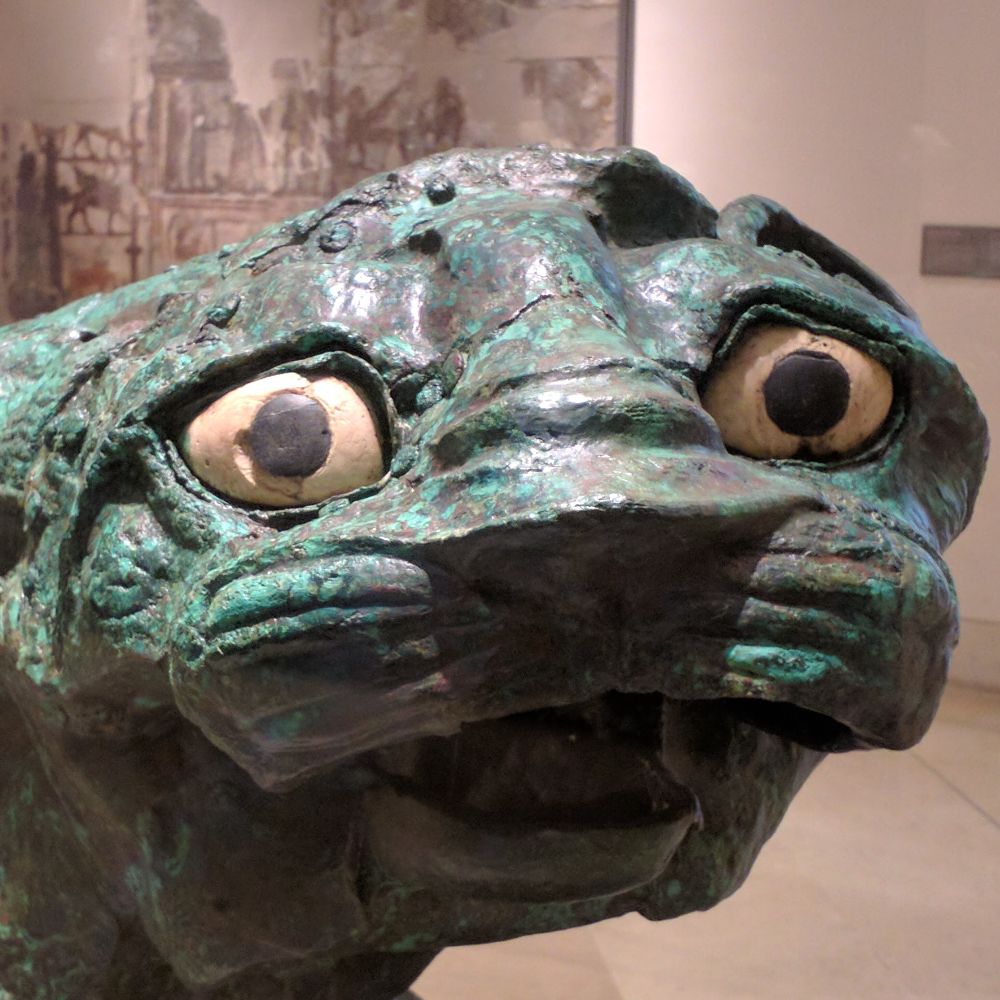
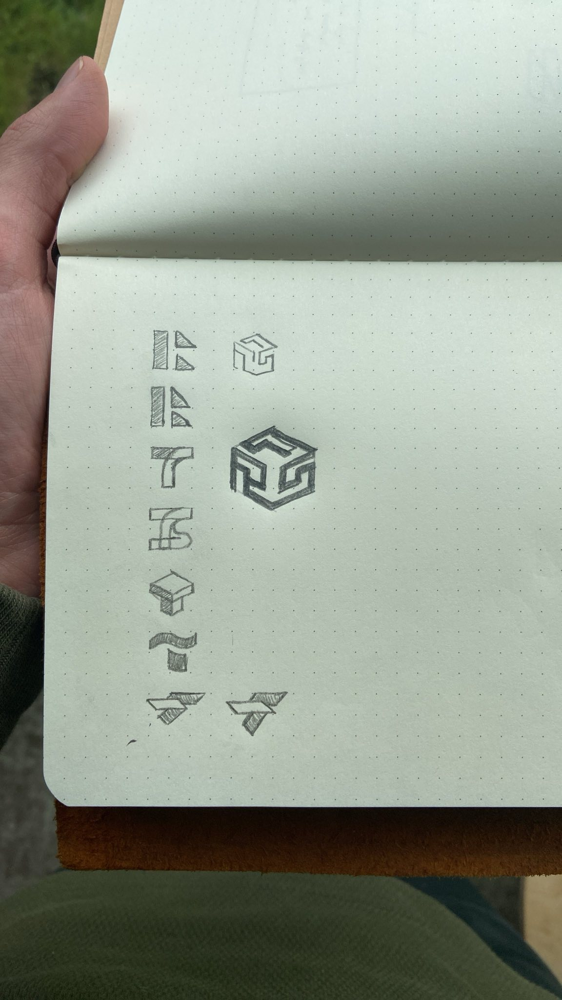
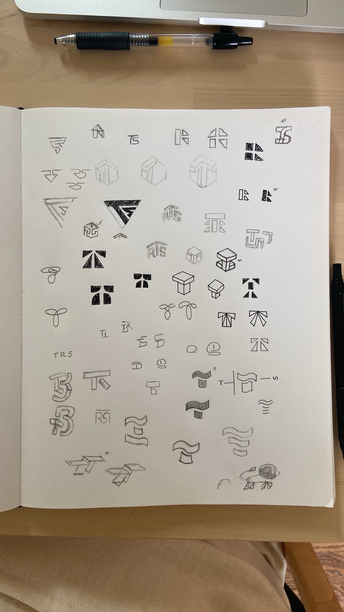
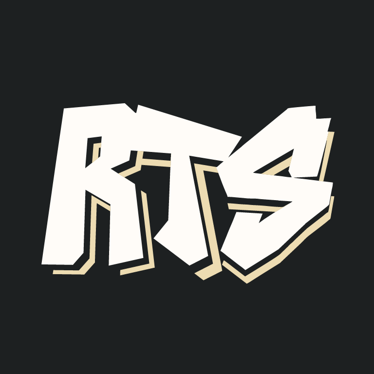
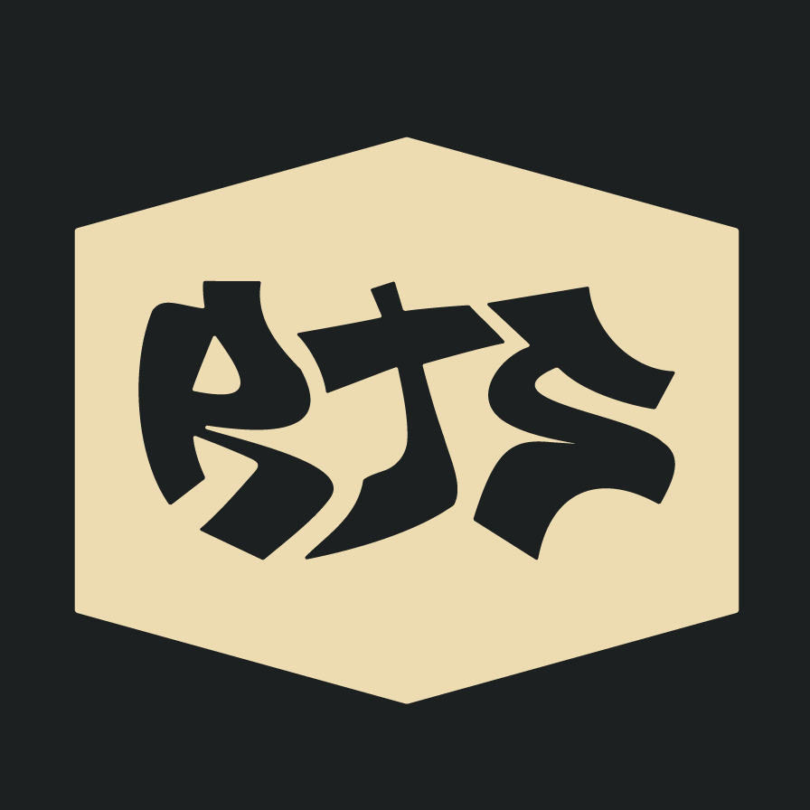
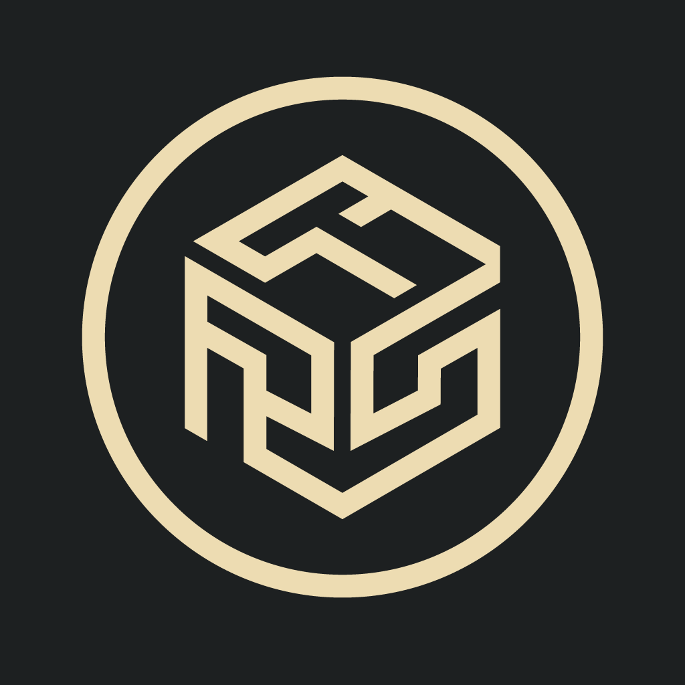
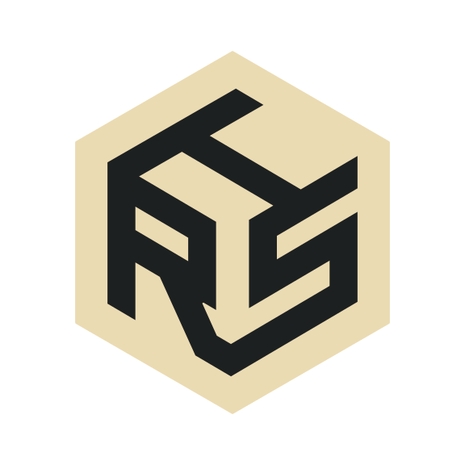
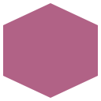
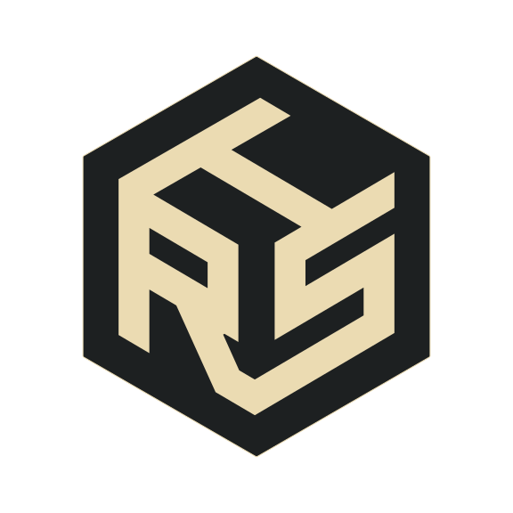

+++
title = "New Year, New Logo"
description = "New year, new logo."
url = "posts/new-year-new-logo"
date = 2024-12-30T15:37:07-08:00
[taxonomies]
tags = ["blogging", "webdev", "SVG"]
+++

I've wanted a more recognizable online "brand" for years. I took a stab at
creating something myself a few times, but was never satisfied with what I
came up with so I finally asked a friend to design a logo for me. The process
was delightful and I'm very happy with the results.

<!-- more -->

# My Brand So Far

For the last several years I've used a photograph that I took of the
[Lion of Mari] at the Louvre as my avatar in digital spaces. It has a goofy
look about it, its mouth agape as if to suggest mock astonishment. I'm not a
dreadfully serious person, so I felt it fit my personality.

<div style="display: flex; align-items: center; justify-content: center;">
  
</div>

This was suitable for many things, but didn't work well in a professional
context. It also got me a lot of questions like "What's with the green dog?"
that I got tired of answering. Solving the problem myself wasn't something I
wanted to spend time on, so I reached out for help.

# Working With A Designer

I worked with [Nathan Hanna], who I'd gotten to know over the last year. On top
of being a delightful human being, I was impressed by his other work in logo
design. After we agreed on a fair price for his work, he asked a handful of
guiding questions to get a feel for what I might like and got to work.

After some consideration my input parameters were:
- The logo could take inspiration from graffiti (an artform I love).
- The logo should incorporate my initials, RTS.
- The logo should feature [hexagons].

Nathan started with pencil and paper drawings, iterated on several designs, and
patiently helped me narrow dozens of options to something that felt just right.

<div style="display: flex; align-items: center; justify-content: center;">
  
  
</div>

<div style="display: flex; align-items: center; justify-content: center;">
  <div>
  
</div>
<div>
  
</div>
<div>
  
</div>
</div>

# The Result

Nathan took my initial parameters and found a winning design. Ultimately we
ditched the graffiti inspiration and landed on this logo where my intials
formed the hexagon itself.

<div style="display: flex; align-items: center; justify-content: center;">
  <div style="width: 50%;">
    
  </div>
  <div style="width: 50%;">
    
  </div>
</div>

Once I was sold, Nathan delivered a few variations and all of the digital
assets including PNGs, SVGs, as well as the original Adobe Illustrator source
files.

# Adding It To the Blog

Since I [redid the style][a-fresh-coat-of-paint] of this blog in 2021 the
[favicon] for this site has been a simple, flat hexagon. Honestly, I didn't love
it, but it served its purpose as a placeholder.

<div style="display: flex; align-items: center; justify-content: center;">
  <div style="width: 256px; height: 256px">
    
  </div>
</div>

The new logo might be a little crowded when shrunk down to the size of a
favicon, but I'd rather be consistent so it's now the favicon. However,
choosing only a light or dark variant of such a simple logo guarantees that it
will be poorly visible in the browser tabs for certain viewers. Thankfully
[SVG] allows for [`<style>`][style] elements.

I took inspiration (once again) from [Andrew Kvalheim] who alters the color of
his favicon based on which color scheme the viewer prefers thanks to the
[`prefers-color-scheme`][prefers-color-scheme] CSS media feature.

```css
:root {
  --outer-fill: #1d2021;
  --inner-fill: #ebdbb2;
}

@media (prefers-color-scheme: dark) {
  :root {
    --outer-fill: #ebdbb2;
    --inner-fill: #1d2021;
  }
}

.cls-1 { fill: var(--outer-fill) }
.cls-2 { fill: var(--inner-fill) }
```

This would have worked perfectly, but just yesterday I learned about the
[`light-dark`][light-dark] CSS color function. This became widely available
just this year and makes it even easier to express light vs. dark color
schemes.

```css
:root {
  color-scheme: light dark;
}

.cls-1 { fill: light-dark(#1d2021, #ebdbb2) }
.cls-2 { fill: light-dark(#ebdbb2, #1d2021) }
```

The end result is a single SVG that displays in light or dark mode depending on
the preference of the viewer.

<div style="display: flex; align-items: center; justify-content: center;">
  <div style="width: 50%;">
    
  </div>
  <div style="width: 50%;">
    
  </div>
</div>

[Lion of Mari]: https://en.wikipedia.org/wiki/Lion_of_Mari
[Nathan Hanna]: https://www.nathanhannadesign.com/
[hexagons]: https://www.youtube.com/watch?v=thOifuHs6eY
[a-fresh-coat-of-paint]: /posts/a-fresh-coat-of-paint
[favicon]: https://en.wikipedia.org/wiki/Favicon
[SVG]: https://en.wikipedia.org/wiki/SVG
[style]: https://developer.mozilla.org/en-US/docs/Web/SVG/Element/style
[Andrew Kvalheim]: https://andrew.kvalhe.im/
[prefers-color-scheme]: https://developer.mozilla.org/en-US/docs/Web/CSS/@media/prefers-color-scheme
[light-dark]: https://developer.mozilla.org/en-US/docs/Web/CSS/color_value/light-dark
