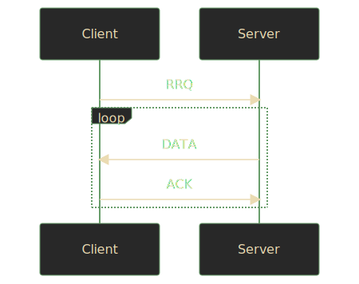

+++
title = "Parsing TFTP in Rust"
description = "TODO"
url = "posts/parsing-tftp-in-rust"
date = 2022-12-31T00:00:00-08:00
[taxonomies]
tags = ["Rust", "TFTP", "Networking", "parsing", "nom"]
+++
Several years ago I did a take-home interview which asked me to write a [TFTP]
server in [Go]. The job wasn't the right fit for me, but I enjoyed the
assignment. Lately, in my spare time, I've been tinkering with a [Rust]
implementation. Here's what I've done to parse the protocol.

<!-- more -->

## Caveat Lector

It's natural to write a technical blog post like this in a somewhat
authoritative tone. However, I am not an authority. There will be mistakes.
Techniques, libraries, and even protocols change over time. Keep in mind that I
am learning too and will happily accept corrections and critiques.

## Why Rust?

Much has been written on the merits of Rust by more qualified people. I
encourage you to seek their writing and make your own decisions. For my part, I
try my best to write fast, safe, and correct code. Rust lets me be more
confident about my solutions without the baggage (and danger) of the last 40
years of C/C++. Recent [statements][memory-safe-android] and
[events][rust-linux-kernel] would seem to agree.

If you know me, you might be surprised that this is my first post on Rust since
I've been hyping up the language for the last 7 years. Better late than never.
😂

## What Is TFTP?

If you already know the ins and outs of TFTP feel free to skip to the
[type design](#type-design) or [parsing](#parsing) sections.

For those who don't know, TFTP is the [Trivial File Transfer Protocol][TFTP], a
simple means of reading and writing files over a network. Initially defined in
the early 80s, the protocol was updated by [RFC 1350] in 1992. In this post
I'll only cover RFC 1350. Extensions like [RFC 2347], which adds a 6th packet
type, won't be covered.

> `TODO`: Consider linking directly to the type design or parsing sections for
> efficient (or knowledgable) readers.

### Security

TFTP is _not_ a secure protocol. It offers no access controls, no
authentication, no encryption, nothing. If you're running a TFTP server assume
that any other host on the network can read the files hosted by it. You should
not run a TFTP server on the open Internet.

### Why Use TFTP?

If TFTP is old, insecure, and protocols like [HTTP] &amp; [SSH] exist, you
might wonder why you'd even bother. Fair enough. If you have other options, you
probably don't need to use it.

That said, TFTP is still widely used, especially in server and lab environments
where there are closed networks. Combined with [DHCP] and [PXE] it provides an
efficient means of [network booting] due to its small memory footprint. This is
especially important for embedded devices where memory is scarce. Additionally,
if your server supports the experimental [multicast] option with [RFC 2090],
files can be read by multiple clients concurrently.

## Protocol Overview

TFTP is implemented atop [UDP], which means it can't benefit from the
retransmission and reliability inherent in [TCP]. Clients and servers must
maintain their own connections. For this reason operations are carried out in
lock-step, requiring acknowledgement at each point, so that nothing is lost or
misunderstood.

Because files might be larger than what can fit into a single packet or even in
memory, TFTP operates on chunks of a file, which it calls "blocks". In RFC 1350
these blocks are always 512 bytes or less, but [RFC 1783] allows clients to
negotiate different sizes which might be better on a particular network.

By default, initial requests are received on port `69`, the offical port
assigned to TFTP by [IANA]. Thereafter, the rest of a transfer is continued on
a random port chosen by the server. This keeps the primary port free to receive
additional requests.

### Reading

To read a file, a client sends a read request packet. If the request is
valid, the server responds with the first block of data. The client sends an
acknowledgement of this block and the server responds with the next block of
data. The two continue this dance until there's nothing more to read.

<!-- TODO: Consider hosting the SVG's CSS locally for more control. -->


### Writing

Writing a file to a server is the inverse of reading. The client sends a write
request packet and the server responds with an acknowledgement. Then the client
sends the first block of data and the server responds with another
acknowledgement. Rinse and repeat until the full file is transferred.

<!-- TODO: Consider hosting the SVG's CSS locally for more control. -->


### Errors

Errors are a valid response to any other packet. Most, if not all, errors are
terminal. Errors are a courtesy and are neither acknowledged nor retransmitted.

## Packet Types

To cover the interactions above, RFC 1350 defines five packet types, each
starting with a different 2 byte opcode. I'll elaborate on each of them in
turn.

| Opcode | Operation                 | Abbreviation |
|--------|:--------------------------|--------------|
| 1      | [Read Request](#rrq-wrq)  | `RRQ`        |
| 2      | [Write Request](#rrq-wrq) | `WRQ`        |
| 3      | [Data](#data)             | `DATA`       |
| 4      | [Acknowledgement](#ack)   | `ACK`        |
| 5      | [Error](#error)           | `ERROR`      |

### `RRQ` / `WRQ`

Read and write requests share a representation, differing only by opcode. They
contain a filename and a mode as [null-terminated strings].

| 2 bytes | string   | 1 byte | string | 1 byte |
|:--------|:---------|:-------|:-------|:-------|
| opcode  | filename | 0      | mode   | 0      |

Here's an example of the raw bytes in an `RRQ` for a file called `foobar.txt`
in `octet` mode.

<pre class="language-rust" data-lang="rust" style="background-color:#282828;color:#fdf4c1aa;"><code class="language-rust" data-lang="rust"><span style="color:#fa5c4b;">let</span><span> rrq </span><span style="color:#fe8019;">= </span><span style="color:#b8bb26;">b"<span style="color:#fa5c4b;">\x00\x01</span>foobar.txt<span style="color:#fa5c4b;">\x00</span>octet<span style="color:#fa5c4b;">\x00</span>"</span><span>;</span></code></pre>

And here's a `WRQ` for the same file in the same mode.

<pre class="language-rust" data-lang="rust" style="background-color:#282828;color:#fdf4c1aa;"><code class="language-rust" data-lang="rust"><span style="color:#fa5c4b;">let</span><span> wrq </span><span style="color:#fe8019;">= </span><span style="color:#b8bb26;">b"<span style="color:#fa5c4b;">\x00\x02</span>foobar.txt<span style="color:#fa5c4b;">\x00</span>octet<span style="color:#fa5c4b;">\x00</span>"</span><span>;</span></code></pre>

#### Modes

TFTP defines modes of transfer which describe how the bytes being transferred
should be handled on the other end. There are three default modes.

| Mode     | Meaning                                                        |
|:---------|:---------------------------------------------------------------|
| netascii | 8-bit [ASCII]; specifies control characters &amp; line endings |
| octet    | raw 8-bit bytes; byte-for-byte identical on both ends          |
| mail     | email the bytes to a user; obsolete even in 1992               |

The protocol allows for other modes to be defined by cooperating hosts, but I
can't recommend that. Honestly, `octet` mode is probably sufficient for most
modern needs.

### `DATA`

Data packets contain the block number being sent and the corresponding data as
raw bytes.

| 2 bytes | 2 bytes     | n bytes   |
|:--------|:------------|:----------|
| opcode  | block &num; | data      |

Here's an example of the raw bytes in a `DATA` packet for the first block of a
transfer with the contents `Hello, World!`.

<pre class="language-rust" data-lang="rust" style="background-color:#282828;color:#fdf4c1aa;"><code class="language-rust" data-lang="rust"><span style="color:#fa5c4b;">let</span><span> data </span><span style="color:#fe8019;">= </span><span style="color:#b8bb26;">b"<span style="color:#fa5c4b;">\x00\x03\x00\x01</span>Hello, World!"</span><span>;</span></code></pre>

### `ACK`

Acknowledgements need only contain the block number they correspond to.

| 2 bytes | 2 bytes     |
|:--------|:------------|
| opcode  | block &num; |

Here's an example of the raw bytes in an `ACK` packet for the first block of a
transfer.

<pre class="language-rust" data-lang="rust" style="background-color:#282828;color:#fdf4c1aa;"><code class="language-rust" data-lang="rust"><span style="color:#fa5c4b;">let</span><span> ack </span><span style="color:#fe8019;">= </span><span style="color:#b8bb26;">b"<span style="color:#fa5c4b;">\x00\x04\x00\x01</span>"</span><span>;</span></code></pre>

### `ERROR`

Errors contain a numeric error code and a human-readable, null-terminated
string error message.

| 2 bytes | 2 bytes    | string        | 1 byte |
|:--------|:-----------|:--------------|:-------|
| opcode  | error code | error message | 0      |

Here's an example of the raw bytes in an `ERROR` packet for a "File not found"
error.

<pre class="language-rust" data-lang="rust" style="background-color:#282828;color:#fdf4c1aa;"><code class="language-rust" data-lang="rust"><span style="color:#fa5c4b;">let</span><span> error </span><span style="color:#fe8019;">= </span><span style="color:#b8bb26;">b"<span style="color:#fa5c4b;">\x00\x05\x00\x01</span>File not found<span style="color:#fa5c4b;">\x00</span>"</span><span>;</span></code></pre>

By default, TFTP defines eight error codes. Since the error code is a 16-bit
integer there's enough space for you and your friends to define 65,528 of your
own. In practice, maybe don't.

| Value  | Meaning                                  |
|--------|:-----------------------------------------|
| 0      | Not defined, see error message (if any). |
| 1      | File not found.                          |
| 2      | Access violation.                        |
| 3      | Disk full or allocation exceeded.        |
| 4      | Illegal TFTP operation.                  |
| 5      | Unknown transfer ID.                     |
| 6      | File already exists.                     |
| 7      | No such user.                            |
| ...    | ...                                      |
| 65,535 | Go wild, do whatever.                    |


## Type Design

Now we all know entirely too much about TFTP. Let's write some code already!

Before I start parsing anything I find it helpful to design the resulting
types. Even in application code I put on my library developer hat so I'm not
annoyed by my own abstractions later.

Let's motivate this design by looking at some code that would use it.

```rust
let mut buffer = [0; 512];
let socket = UdpSocket::bind("127.0.0.1:6969")?;
let length = socket.recv(&mut buffer)?;

let data = &buffer[..length];
todo!("Get our packet out of data!");
```

In both [`std::net::UdpSocket`][std-udpsocket] and
[`tokio::net::UdpSocket`][tokio-udpsocket] the interface that we have to
work knows nothing about packets, only raw `&[u8]` (a [slice] of [bytes][u8]).

So, our task is to turn a `&[u8]` into something else. But what? In other
implementations I've seen it's common to think of all 5 packet types as
variations on a theme. We could follow suit, doing the Rusty thing and define
an `enum`.

```rust
enum Packet {
    Rrq,
    Wrq,
    Data,
    Ack,
    Error,
}
```

I might have liked my Go implemenation to look like this. If Go even had enums!
😒

This design choice has an unintended consequence though. As mentioned earlier,
`RRQ` and `WRQ` only really matter on initial request. The remainder of the
transfer isn't concerned with those variants. Even so, Rust's (appreciated)
insistence on exhaustively matching patterns would make us write code like
this.

```rust
match packet(&data)? {
    Packet::Data => handle_data(),
    Packet::Ack => handle_ack(),
    Packet::Error => handle_error(),
    _ => unreachable!("Didn't we already handle this?"),
}
```

Also, you might be tempted to use [`unreachable!`][unreachable] for such code,
but it actually _is_ reachable. An ill-behaved client could send a request
packet mid-connection and this design would allow it!

Instead, what if we were more strict with our types and split the initial
`Request` from the rest of the `Transfer`?

### Requests

Before we can talk about a `Request` we should talk about its parts. When we
talked about packet types we saw that `RRQ` and `WRQ` only differed by opcode
and the rest of the packet was the same, a `filename` and a `mode`.

A `Mode` is another natural `enum`, but for our purposes we'll only bother with
the `Octet` variant for now.

```rust
pub enum Mode {
    // Netascii, for completeness.
    Octet,
    // Mail, if only to gracefully send an ERROR.
}
```

A `Mode` combined with a `filename` make up the "inner type", which I'll call a
`Payload` for lack of a better term. I've taken some liberties by declaring
`filename` a [`PathBuf`][pathbuf], which we'll touch on _briefly_ in the
[parsing section](#parsing).

```rust
pub struct Payload {
    pub filename: PathBuf,
    pub mode: Mode,
}
```

Now we can define a `Request` as an `enum` where each variant has a `Payload`.

```rust
pub enum Request {
    Read(Payload),
    Write(Payload),
}
```

### Transfers

`Request` takes care of `RRQ` and `WRQ` packets, so a `Transfer` `enum` needs
to take care of the remaining `DATA`, `ACK`, &amp; `ERROR` packets. Transfers
are the meat of the protocol and more complex than requests. Let's break down
each variant.

#### `Data`

The `Data` variant needs to contain the `block` number, which is 2 bytes and
fits neatly into a [`u16`][u16]. It also needs to contain the raw bytes of the
`data`. There are many ways to represent this, including using a
[`Vec<u8>`][Vec] or a [`bytes::Bytes`][Bytes]. However, I think the most
straightforward is as a `&[u8]` even though it introduces a [lifetime].

#### `Ack`

The `Ack` packet is the simplest and only needs a `block` number. We'll use a
solitary `u16` for that.

#### `Error`

The `Error` variant warrants more consideration because of the well-defined
[error codes](#error). I abhor [magic numbers] in my code, so I'll prefer to
define another `enum` called `ErrorCode` for those. For the `message` a
`String` should suffice.

##### `ErrorCode`

Defining an `ErrorCode` involves more boilerplate than I'd like, so I'll show
three variants and leave the remainder as an exercise for the reader.

```rust
#[derive(Copy, Clone)]
pub enum ErrorCode {
    Undefined,
    FileNotFound,
    // ...
    Unknown(u16),
}
```

The `Undefined` variant is, humorusly, defined, but the `Unknown` variant which
I've added here is not part of RFC 1350. It merely acts as a catchall for
remaining error space. Conveniently Rust enums allow variants to contain other
data.

Because of this `Unknown` variant I didn't opt for a C-style enum like

```rust
enum ErrorCode {
    Undefined = 0,
    FileNotFound = 1,
    // ...
}
```

so we can't cast an `ErrorCode` to a `u16`.

```rust
// This explodes! 💣💥
let code = ErrorCode::Unknown(42) as u16;
```

However, we can add [`From`][from] implementations. One to convert
from an `ErrorCode` to a `u16`.

```rust
impl From<ErrorCode> for u16 {
    fn from(error_code: ErrorCode) -> Self {
        match error_code {
            ErrorCode::Undefined => 0,
            ErrorCode::FileNotFound => 1,
            // ...
            ErrorCode::Unknown(n) => n,
        }
    }
}
```

And another to convert from a `u16` to an `ErrorCode`.

```rust

impl From<u16> for ErrorCode {
    fn from(code: u16) -> Self {
        match code {
            0 => Self::Undefined,
            1 => Self::FileNotFound,
            // ...
            n => Self::Unknown(n),
        }
    }        
}
```

That way we still have a convenient method for conversions.

```rust
let code = 42;
let error: ErrorCode = code.into();
assert_eq!(error, ErrorCode::Unknown(42));
```

#### Putting It All Together

With each variant considered, we arrive at an `enum` that looks like this.

```rust
pub enum Transfer<'a> {
    Data { block: u16, data: &'a [u8] },
    Ack { block: u16 },
    Error { code: ErrorCode, message: String },
}
```

I could have defined structs to hold the inner data for each variant like I did
with `Payload` earlier, but because none of the variants had the same shape I
felt less inclined to do so.

## Parsing

Now that we have a high-level type design to match the low-level network
representation we can bridge the two by parsing. There are as many ways to
shave this [Yacc] as there were enums in our packet types, but I settled on the
[`nom`][nom] library.

### What Is nom?

nom's own [readme][nom-readme] does a better job of describing itself than I
ever could, so I'll just let it do the talking.

> nom is a parser combinators library written in Rust. Its goal is to provide
> tools to build safe parsers without compromising the speed or memory
> consumption. To that end, it uses extensively Rust's strong typing and memory
> safety to produce fast and correct parsers, and provides functions, macros
> and traits to abstract most of the error prone plumbing.

That sounds good and all, but what the heck is a parser combinator? Once again,
nom has a great [description][nom-combinators] which I encourage you to read.
The gist is that, unlike other approaches, parser combinators encourage you to
give your parsing a functional flair. You construct small functions to parse
the simplest patterns and gradually compose them to handle more complex inputs.

nom has an extra advantage in that it is byte-oriented. It uses `&[u8]` as its
base type, which makes it convenient for parsing network protocols. This is
exactly the type we receive off the wire.

### Defining Combinators

It's finally time to define some combinators and do some parsing! Even if
you're familiar with Rust, nom combinators might look more like Greek to you.
I'll explain the first one in depth to show how they work and then explain only
the more confusing parts as we go along. First, a small primer.

nom combinators return [`IResult`][iresult], a custom [`Result`][result] type
generic over three types instead of the usual two.

```rust
pub type IResult<I, O, E = Error<I>> = Result<(I, O), Err<E>>;
```

These types are the input type`I`, the output type `O`,
and the error type `E` (usually a [nom error][nom-error]). I understand this
type to mean that `I` will be parsed to produce `O` and any leftover `I` as
long as no error `E` happens.

#### Null Strings

`null` references are famously a "[billion dollar mistake]" and I can't say I
like `null` any better in this protocol.

> Like all other strings, it is terminated with a zero byte.<br>
> &mdash; RFC 1350, smugly

Or, you know, just tell me how long the darn string is. You're the one who put
it in the packet... Yes, I know why you did it, but I don't have to like it. 🤪

Mercifully, the nom toolkit has everything we need to slay this beast.

```rust
fn null_str(input: &[u8]) -> IResult<&[u8], &str> {
    map_res(
        tuple((take_till(|b| b == b'\x00'), tag(b"\x00"))),
        |(s, _)| std::str::from_utf8(s),
    )(input)
}
```

Let's work inside out to understand what `null_str` is doing.

1. [`take_till`][take-till] accepts function (here we use a closure with `b`
   for each byte) and collects up bytes from the `input` until one of
   the bytes matches the null byte, `b'\x00'`. This gets us a `&[u8]` up until,
   _but not including_, our zero byte.

2. [`tag`][tag] here just recognizes the zero byte for completeness, but we'll
   discard it later.

3. [`tuple`][tuple] applies a tuple of parsers one by one and returns their
   results as a tuple.

4. [`map_res`][map-res] applies a function returning a [`Result`][result] over
   the result of a parser. This gives us a nice way to call a fallible function
   on the results of earlier parsing, `take_till` and `tag` in this case.

5. [`std::str::from_utf8`][from-utf-8], the fallible function inside our
   outermost closure, converts our `&[u8]` (now sans zero byte) into a Rust
   [`&str`][str], which is **not** terminated with a zero byte.

6. [`IResult<&[u8], &str>`][iresult] ties it all together at the end in
   `null_str`'s return signature returning any unmatched `&[u8]` and a `&str`
   if successful.

It's important to note that I'm taking another <u><b>huge</b></u> liberty here
by converting these bytes to a Rust string at all. Rust strings are guaranteed
to be valid [UTF-8][utf-8]. TFTP [predates UTF-8][utf-8-history], so the
protocol did not specify that these strings should be Unicode. Later, I might
look into an [`OsString`][osstring], but for now non-Unicode strings will cause
failures.

> Please, only send me UTF-8 strings.<br>
> &mdash; Me, wearily

#### Request Combinators

> `TODO`

#### Transfer Combinators

> `TODO`

## Serialization

We can now read bytes into packets, which is handy, but astute readers will
have noticed that you need to do the reverse if you're going to have a full
TFTP conversation. Luckily, this serialization is (mostly) infallible, so
there's less to explain.

> `TODO` Talk about why `BufMut`

> `TODO` Talk about potential for panic

### Serializing `Request`

Serializing a `Request` packet is deceptively straightfoward. We use a `match`
expression to pull our `Payload` out of the request and associate with with an
`OpCode`. Then we just serialize the opcode as a `u16` with
[`put_u16`][put-u16] The `filename` and `mode` we serialize as null-terminated
strings using a combo of [`put_slice`][put-slice] and [`put_u8`][put-u8].

```rust
impl Request {
    pub fn serialize(&self, buffer: &mut BytesMut) {
        let (opcode, payload) = match self {
            Request::Read(payload) => (OpCode::Rrq, payload),
            Request::Write(payload) => (OpCode::Wrq, payload),
        };

        buffer.put_u16(opcode as u16);
        buffer.put_slice(payload.filename.to_string_lossy().as_bytes());
        buffer.put_u8(0x0);
        buffer.put_slice(payload.mode.to_string().as_bytes());
        buffer.put_u8(0x0);
    }
}
```

Converting our `mode` with [`as_bytes`][as-bytes] through a
[`to_string`][to-string] is possible thanks to our earlier [`Display`][display]
impl for `Mode`. The `filename` conversion to bytes through `PathBuf`'s
[`to_string_lossy`][to-string-lossy] might reasonably raise some eyebrows.
Unlike strings a Rust path is not guaranteed to be UTF-8, so any non-Unicode
characters will be replaced with [� (U+FFFD)][replacement-character]. For now,
given my earlier Unicode decision I'm comfortable with this, but a more robust
method is desirable.

### Serializing `Transfer`

Serializing a `Transfer` packet is more straightforward.

```rust
impl<'a> Transfer<'a> {
    pub fn serialize(&self, buffer: &mut BytesMut) {
        match *self {
            Self::Data { block, data } => {
                buffer.put_u16(OpCode::Data as u16);
                buffer.put_u16(block);
                buffer.put_slice(data);
            }
            Self::Ack { block } => {
                buffer.put_u16(OpCode::Ack as u16);
                buffer.put_u16(block);
            }
            Self::Error { code, ref message } => {
                buffer.put_u16(OpCode::Error as u16);
                buffer.put_u16(code.into());
                buffer.put_slice(message.as_bytes());
                buffer.put_u8(0x0);
            }
        }
    }
}
```

As before, with each variant we serialize a `u16` for the `OpCode` and then do
variant-specific serialization.

- For `Data` we serialize a `u16` for the block number and then the
  remainder of the data.
- For `Ack` we also serialize a `u16` block number.
- For `Error` we use our [`From`][from] impl from earlier to serialize the
  `ErrorCode` as a `u16` and then serialize the `message` as a null-terminated
  string.

That's it! Now we can read and write structured data to and from raw bytes! 🎉

## Tests

A post on parsing wouldn't be complete without some tests showing that our code
works as expected. First, we'll use the marvelous [`test-case`][test-case]
crate to bang out a few negative tests on things we expect to be errors.

> `TODO` Convert these examples to use the good byte highlighting.

```rust
#[test_case(b"\x00" ; "too small")]
#[test_case(b"\x00\x00foobar.txt\x00octet\x00" ; "too low")]
#[test_case(b"\x00\x03foobar.txt\x00octet\x00" ; "too high")]
fn invalid_request(input: &[u8]) {
    let actual = Request::deserialize(input);
    // We don't care about the nom details, so ignore them with ..
    assert!(matches!(actual, Err(ParseRequestError(..))));
}
```

And, for good measure, we'll show that we can round-trip an `RRQ` packet from
raw bytes with a stop at a proper enum in between.

```rust
#[test]
fn roundtrip_rrq() -> Result<(), ParsePacketError> {
    let before = b"\x00\x01foobar.txt\x00octet\x00";
    let expected = Request::Read(Payload {
        filename: "foobar.txt".into(),
        mode: Mode::Octet,
    });
    
    let packet = Request::deserialize(before)?;
    // Use an under-capacity buffer to test panics.
    let mut after = BytesMut::with_capacity(4);
    packet.serialize(&mut after);
    
    assert_eq!(packet, expected);
    assert_eq!(&before[..], after);
}
```

Unless you want to copy/paste all this code you'll have to trust me that the
tests pass. 😉 Don't worry, I've written many more tests, but this is a blog
post, not a test suite, so I'll spare you the details.

## `Ack`nowledgements

Wow. You actually read all the way to the end. Congrats, and more importantly,
thank you! 🙇‍♂️ 

All of the work above is part of a personal project I chip away at
in my spare time, but I don't do it alone. I owe a huge debt of gratitude to my
friend &amp; Rust mentor, [Zefira], who has spent countless hours letting me
pick her brain on every minute detail of
this TFTP code. I could not have written this blog post without her!

I also need to thank Yiannis M ([`@oblique`][oblique]) for their work on the
[`async-tftp-rs`][async-tftp-rs] crate, from which I have borrowed liberally
and learned a great deal. You may recognize some combinators if you dive into
that code.

The source code for the rest of the project is not currently public, but when
I'm more confident in it I'll definitely share more details. Meanwhile, I
welcome any and all suggestions on how to make what I've written here more
efficient and safe.

> `TODO` Pin crates to specific links?

> `TODO` Change `#Networking` tag to `#networking`?

> `TODO` Stop highlighting all `enum` references.

[Go]: https://go.dev/
[TFTP]: https://en.wikipedia.org/wiki/Trivial_File_Transfer_Protocol
[DHCP]: https://en.wikipedia.org/wiki/Dynamic_Host_Configuration_Protocol
[PXE]: https://en.wikipedia.org/wiki/Preboot_Execution_Environment
[network booting]: https://en.wikipedia.org/wiki/Network_booting
[multicast]: https://en.wikipedia.org/wiki/Multicast
[RFC 2090]: https://www.rfc-editor.org/rfc/rfc2090
[Rust]: https://www.rust-lang.org/
[memory-safe-android]: https://security.googleblog.com/2022/12/memory-safe-languages-in-android-13.html
[rust-linux-kernel]: https://lwn.net/Articles/910762/
[RFC 1350]: https://www.rfc-editor.org/rfc/rfc1350
[RFC 2347]: https://www.rfc-editor.org/rfc/rfc2347
[RFC 1783]: https://www.rfc-editor.org/rfc/rfc1783
[IANA]: https://en.wikipedia.org/wiki/Internet_Assigned_Numbers_Authority
[HTTP]: https://en.wikipedia.org/wiki/Hypertext_Transfer_Protocol
[SSH]: https://en.wikipedia.org/wiki/Secure_Shell
[UDP]: https://en.wikipedia.org/wiki/User_Datagram_Protocol
[TCP]: https://en.wikipedia.org/wiki/Transmission_Control_Protocol
[ASCII]: https://en.wikipedia.org/wiki/ASCII
[null-terminated strings]: https://en.wikipedia.org/wiki/Null-terminated_string
[std-udpsocket]: https://doc.rust-lang.org/std/net/struct.UdpSocket.html
[tokio-udpsocket]: https://docs.rs/tokio/1.23.0/tokio/net/struct.UdpSocket.html
[slice]: https://doc.rust-lang.org/std/primitive.slice.html
[unreachable]: https://doc.rust-lang.org/std/macro.unreachable.html
[pathbuf]: https://doc.rust-lang.org/std/path/struct.PathBuf.html
[u16]: https://doc.rust-lang.org/std/primitive.u16.html
[u8]: https://doc.rust-lang.org/std/primitive.u8.html
[lifetime]: https://doc.rust-lang.org/rust-by-example/scope/lifetime.html
[magic numbers]: https://en.wikipedia.org/wiki/Magic_number_(programming)
[from]: https://doc.rust-lang.org/std/convert/trait.From.html
[Yacc]: https://en.wikipedia.org/wiki/Yacc
[nom]: https://crates.io/crates/nom
[nom-readme]: https://github.com/rust-bakery/nom/blob/6860641f1b003781f9dc1a91d0f631ff17400d1b/README.md
[nom-combinators]: https://github.com/rust-bakery/nom/blob/6860641f1b003781f9dc1a91d0f631ff17400d1b/README.md#parser-combinators
[billion dollar mistake]: https://www.infoq.com/presentations/Null-References-The-Billion-Dollar-Mistake-Tony-Hoare/
[take-till]: https://docs.rs/nom/7.1.1/nom/bytes/complete/fn.take_till.html
[tag]: https://docs.rs/nom/7.1.1/nom/bytes/complete/fn.tag.html
[tuple]: https://docs.rs/nom/7.1.1/nom/sequence/fn.tuple.html
[map-res]: https://docs.rs/nom/7.1.1/nom/combinator/fn.map_res.html
[result]: https://doc.rust-lang.org/core/result/enum.Result.html
[from-utf-8]: https://doc.rust-lang.org/std/str/fn.from_utf8.html
[str]: https://doc.rust-lang.org/std/primitive.str.html
[iresult]: https://docs.rs/nom/7.1.1/nom/type.IResult.html
[nom-error]: https://docs.rs/nom/7.1.1/nom/error/struct.Error.html
[utf-8]: https://en.wikipedia.org/wiki/UTF-8
[utf-8-history]: https://en.wikipedia.org/wiki/UTF-8#History
[osstring]: https://doc.rust-lang.org/std/ffi/struct.OsString.html
[put-u16]: https://docs.rs/bytes/1.3.0/bytes/trait.BufMut.html#method.put_u16
[put-slice]: https://docs.rs/bytes/1.3.0/bytes/trait.BufMut.html#method.put_slice
[put-u8]: https://docs.rs/bytes/1.3.0/bytes/trait.BufMut.html#method.put_u8
[display]: https://doc.rust-lang.org/std/fmt/trait.Display.html
[as-bytes]: https://doc.rust-lang.org/std/string/struct.String.html#method.as_bytes
[to-string]: https://doc.rust-lang.org/std/string/trait.ToString.html#tymethod.to_string
[to-string-lossy]: https://doc.rust-lang.org/std/path/struct.PathBuf.html#method.to_string_lossy
[replacement-character]: https://doc.rust-lang.org/std/char/constant.REPLACEMENT_CHARACTER.html
[Vec]: https://doc.rust-lang.org/std/vec/struct.Vec.html
[Bytes]: https://docs.rs/bytes/1.3.0/bytes/struct.Bytes.html
[test-case]: https://crates.io/crates/test-case
[Zefira]: https://zefira.dev/
[oblique]: https://github.com/oblique
[async-tftp-rs]: https://crates.io/crates/async-tftp
