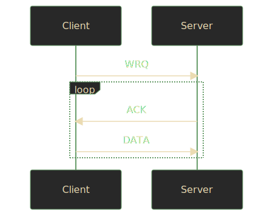

+++
title = "Parsing TFTP in Rust"
description = "TODO"
url = "posts/parsing-tftp-in-rust"
date = 2022-12-31T00:00:00-08:00
[taxonomies]
tags = ["Rust", "TFTP", "Networking", "parsing", "nom"]
+++
Several years ago I did a take-home interview which asked me to write a [TFTP]
server in [Go]. The job wasn't the right fit for me, but I enjoyed the
assignment. Lately, in my spare time, I've been tinkering with a [Rust]
implementation. Here's what I've done to parse the protocol.

<!-- more -->

## Caveat Lector

It's natural to write a technical blog post like this in a somewhat
authoritative tone. However, I am not an authority. There will be mistakes.
Techniques, libraries, and even protocols change over time. Keep in mind that I
am learning too and will happily accept corrections and critiques.

## Why Rust?

Much has been written on the merits of Rust by more qualified people. I
encourage you to seek their writing and make your own decisions. For my part, I
try my best to write fast, safe, and correct code. Rust lets me be more
confident about my solutions without the baggage (and danger) of the last 40
years of C/C++. Recent [statements][memory-safe-android] and
[events][rust-linux-kernel] would seem to agree.

If you know me, you might be surprised that this is my first post on Rust since
I've been hyping up the language for the last 7 years. Better late than never.
😂

## What Is TFTP?

TFTP is the [Trivial File Transfer Protocol][TFTP], a simple means of reading
and writing files over a network. Initially defined in the early 80s, the
protocol was updated by [RFC 1350] in 1992. In this post I'll only cover RFC
1350. Extensions like [RFC 2347], which adds a 6th packet type, won't be
covered.

> `TODO`: Consider linking directly to the type design or parsing sections for
> efficient (or knowledgable) readers.

### Security

TFTP is _not_ a secure protocol. It offers no access controls, no
authentication, no encryption, nothing. If you're running a TFTP server assume
that any other host on the network can read the files hosted by it. You should
not run a TFTP server on the open Internet.

### Why Use TFTP?

If TFTP is old, insecure, and protocols like [HTTP] &amp; [SSH] exist, you
might wonder why you'd even bother. Fair enough. If you have other options, you
probably don't need to use it.

That said, TFTP is still widely used, especially in server and lab environments
where there are closed networks. Combined with [DHCP] and [PXE] it provides an
efficient means of [network booting] due to its small memory footprint. This is
especially important for embedded devices where memory is scarce. Additionally,
if your server supports the experimental [multicast] option with [RFC 2090],
files can be read by multiple clients concurrently.

## Protocol Overview

TFTP is implemented atop [UDP], which means it can't benefit from the
retransmission and reliability inherent in [TCP]. Clients and servers must
maintain their own connections. For this reason operations are carried out in
lock-step, requiring acknowledgement at each point, so that nothing is lost or
misunderstood.

Because files might be larger than what can fit into a single packet or even in
memory, TFTP operates on chunks of a file, which it calls "blocks". In RFC 1350
these blocks are always 512 bytes or less, but [RFC 1783] allows clients to
negotiate different sizes which might be better on a particular network.

By default, initial requests are received on port `69`, the offical port
assigned to TFTP by [IANA]. Thereafter, the rest of a transfer is continued on
a random port chosen by the server. This keeps the primary port free to receive
additional requests.

### Reading

To read a file, a client sends a read request packet. If the request is
valid, the server responds with the first block of data. The client sends an
acknowledgement of this block and the server responds with the next block of
data. The two continue this dance until there's nothing more to read.


### Writing

Writing a file to a server is the inverse of reading. The client sends a write
request packet and the server responds with an acknowledgement. Then the client
sends the first block of data and the server responds with another
acknowledgement. Rinse and repeat until the full file is transferred.



### Errors

Errors are a valid response to any other packet. Most, if not all, errors are
terminal. Errors are a courtesy and are neither acknowledged nor retransmitted.

## Packet Types

To cover the interactions above, RFC 1350 defines five packet types, each
starting with a different 2 byte opcode. I'll elaborate on each of them in
turn.

| Opcode | Operation                 | Abbreviation |
|--------|:--------------------------|--------------|
| 1      | [Read Request](#rrq-wrq)  | `RRQ`        |
| 2      | [Write Request](#rrq-wrq) | `WRQ`        |
| 3      | [Data](#data)             | `DATA`       |
| 4      | [Acknowledgement](#ack)   | `ACK`        |
| 5      | [Error](#error)           | `ERROR`      |

### `RRQ` / `WRQ`

Read and write requests share a representation, differing only by opcode. They
contain a filename and a mode as [null-terminated strings].

| 2 bytes | string   | 1 byte | string | 1 byte |
|:--------|:---------|:-------|:-------|:-------|
| opcode  | filename | 0      | mode   | 0      |

Here's an example of the raw bytes in an `RRQ` for a file called `foobar.txt`
in `octet` mode.

<pre class="language-rust" data-lang="rust" style="background-color:#282828;color:#fdf4c1aa;"><code class="language-rust" data-lang="rust"><span style="color:#fa5c4b;">let</span><span> rrq </span><span style="color:#fe8019;">= </span><span style="color:#b8bb26;">b"<span style="color:#fa5c4b;">\x00\x01</span>foobar.txt<span style="color:#fa5c4b;">\x00</span>octet<span style="color:#fa5c4b;">\x00</span>"</span><span>;</span></code></pre>

And here's a `WRQ` for the same file in the same mode.

<pre class="language-rust" data-lang="rust" style="background-color:#282828;color:#fdf4c1aa;"><code class="language-rust" data-lang="rust"><span style="color:#fa5c4b;">let</span><span> wrq </span><span style="color:#fe8019;">= </span><span style="color:#b8bb26;">b"<span style="color:#fa5c4b;">\x00\x02</span>foobar.txt<span style="color:#fa5c4b;">\x00</span>octet<span style="color:#fa5c4b;">\x00</span>"</span><span>;</span></code></pre>

#### Modes

TFTP defines modes of transfer which describe how the bytes being transferred
should be handled on the other end. There are three default modes.

| Mode     | Meaning                                                        |
|:---------|:---------------------------------------------------------------|
| netascii | 8-bit [ASCII]; specifies control characters &amp; line endings |
| octet    | raw 8-bit bytes; byte-for-byte identical on both ends          |
| mail     | email the bytes to a user; obsolete even in 1992               |

The protocol allows for other modes to be defined by cooperating hosts, but I
can't recommend that. Honestly, `octet` mode is probably sufficient for most
modern needs.

### `DATA`

Data packets contain the block number being sent and the corresponding data as
raw bytes.

| 2 bytes | 2 bytes     | n bytes   |
|:--------|:------------|:----------|
| opcode  | block &num; | data      |

Here's an example of the raw bytes in a `DATA` packet for the first block of a
transfer with the contents `Hello, World!`.

<pre class="language-rust" data-lang="rust" style="background-color:#282828;color:#fdf4c1aa;"><code class="language-rust" data-lang="rust"><span style="color:#fa5c4b;">let</span><span> data </span><span style="color:#fe8019;">= </span><span style="color:#b8bb26;">b"<span style="color:#fa5c4b;">\x00\x03\x00\x01</span>Hello, World!"</span><span>;</span></code></pre>

### `ACK`

Acknowledgements need only contain the block number they correspond to.

| 2 bytes | 2 bytes     |
|:--------|:------------|
| opcode  | block &num; |

Here's an example of the raw bytes in an `ACK` packet for the first block of a
transfer.

<pre class="language-rust" data-lang="rust" style="background-color:#282828;color:#fdf4c1aa;"><code class="language-rust" data-lang="rust"><span style="color:#fa5c4b;">let</span><span> ack </span><span style="color:#fe8019;">= </span><span style="color:#b8bb26;">b"<span style="color:#fa5c4b;">\x00\x04\x00\x01</span>"</span><span>;</span></code></pre>

### `ERROR`

Errors contain a numeric error code and a human-readable, null-terminated
string error message.

| 2 bytes | 2 bytes    | string        | 1 byte |
|:--------|:-----------|:--------------|:-------|
| opcode  | error code | error message | 0      |

Here's an example of the raw bytes in an `ERROR` packet for a "File not found"
error.

<pre class="language-rust" data-lang="rust" style="background-color:#282828;color:#fdf4c1aa;"><code class="language-rust" data-lang="rust"><span style="color:#fa5c4b;">let</span><span> error </span><span style="color:#fe8019;">= </span><span style="color:#b8bb26;">b"<span style="color:#fa5c4b;">\x00\x05\x00\x01</span>File not found<span style="color:#fa5c4b;">\x00</span>"</span><span>;</span></code></pre>

By default, TFTP defines eight error codes. Since the error code is a 16-bit
integer there's enough space for you and your friends to define 65,528 of your
own. In practice, maybe don't.

| Value    | Meaning                                  |
|----------|:-----------------------------------------|
| 0        | Not defined, see error message (if any). |
| 1        | File not found.                          |
| 2        | Access violation.                        |
| 3        | Disk full or allocation exceeded.        |
| 4        | Illegal TFTP operation.                  |
| 5        | Unknown transfer ID.                     |
| 6        | File already exists.                     |
| 7        | No such user.                            |
| &hellip; | &hellip;                                 |
| 65,535   | Go wild, do whatever.                    |


## Type Design

Now we all know entirely too much about TFTP. Let's write some code already!

Before I start parsing anything I find it helpful to design the resulting
types. Even in application code I put on my library developer hat so I'm not
annoyed by my own abstractions later.

Let's motivate this design by looking at some code that would use it.

```rust
let mut buffer = [0; 512];
let socket = UdpSocket::bind("127.0.0.1:6969")?;
let length = socket.recv(&mut buffer)?;

let data = &buffer[..length];
todo!("Get our packet out of data!");
```

In both [`std::net::UdpSocket`][std-udpsocket] and
[`tokio::net::UdpSocket`][tokio-udpsocket] the interface that we have to
work knows nothing about packets, only raw `&[u8]` (a [slice] of bytes).

So, our task is to turn a `&[u8]` into something else. But what? In other
implementations I've seen it's common to think of all 5 packet types as
variations on a theme. We could follow suit, doing the Rusty thing and define
an `enum`.

```rust
enum Packet {
    Rrq,
    Wrq,
    Data,
    Ack,
    Error,
}
```

I might have liked my Go implemenation to look like this. If Go even had enums!
😒

This design choice has an unintended consequence though. As mentioned earlier,
`RRQ` and `WRQ` only really matter on initial request. The remainder of the
transfer isn't concerned with those variants. Even so, Rust's (appreciated)
insistence on exhaustively matching patterns would make us write code like
this.

```rust
match packet(&data)? {
    Packet::Data => handle_data(),
    Packet::Ack => handle_ack(),
    Packet::Error => handle_error(),
    _ => unreachable!("Didn't we already handle this?"),
}
```

Also, you might be tempted to use [`unreachable!`][unreachable] for such code,
but it actually _is_ reachable. A malicious client could send a request packet
mid-connection and this design would allow it!

Instead, what if we were more strict with our types and split the initial
`Request` from the rest of the `Transfer`?

### Requests

Before we can talk about a `Request` we should talk about its parts. When we
talked about packet types we saw that `RRQ` and `WRQ` only differed by opcode
and the rest of the packet was the same, a `filename` and a `mode`.

A `Mode` is another natural `enum`, but for our purposes we'll only bother with
the `Octet` variant for now.

```rust
pub enum Mode {
    // Netascii, for completeness.
    Octet,
    // Mail, if only to gracefully send an ERROR.
}
```

A `Mode` combined with a `filename` make up the "inner type", which I'll call a
`Payload` for lack of a better term. I've taken some liberties by declaring
`filename` a [`PathBuf`][pathbuf], which we'll touch on _briefly_ in the
[parsing section](#parsing).

```rust
pub struct Payload {
    pub filename: PathBuf,
    pub mode: Mode,
}
```

Now we can define a `Request` as an `enum` where each variant has a `Payload`.

```rust
pub enum Request {
    Read(Payload),
    Write(Payload),
}
```

### Transfers

`Request` takes care of `RRQ` and `WRQ` packets, so a `Transfer` `enum` needs
to take care of the remaining `DATA`, `ACK`, &amp; `ERROR` packets. Transfers
are the meat of the protocol and more complex than requests. Let's break down
each variant.

#### `Data`

The `Data` variant needs to contain the `block` number, which is 2 bytes and
fits neatly into a [`u16`][u16]. It also needs to contain the raw bytes of the
`data`. There are many ways to represent this, including using a
[`Vec<u8>`][Vec] or a [`bytes::Bytes`][Bytes]. However, I think the most
straightforward is as a `&[u8]` even though it introduces a [lifetime].

#### `Ack`

The `Ack` packet is the simplest and only needs a `block` number. We'll use a
solitary `u16` for that.

#### `Error`

The `Error` variant warrants more consideration because of the well-defined
error codes. I abhor [magic numbers] in my code, so I'll prefer to define another
`enum` called `ErrorCode` for those. For the `message` a `String` should
suffice.

##### `ErrorCode`

Defining an `ErrorCode` involves more boilerplate than I'd like, so I'll show
three variants and leave the remainder as an exercise for the reader.

```rust
#[derive(Copy, Clone)]
pub enum ErrorCode {
    Undefined,
    FileNotFound,
    // ...
    Unknown(u16),
}
```

The `Undefined` variant is, humorusly, defined, but the `Unknown` variant which
I've added here is not part of RFC 1350. It merely acts as a catchall for
remaining error space. Conveniently Rust enums allow variants to contain other
data.

Because of this `Unknown` variant I didn't opt for a C-style enum like

```rust
enum ErrorCode {
    Undefined = 0,
    FileNotFound = 1,
    // ...
}
```

so we can't cast an `ErrorCode` to a `u16`.

```rust
// This explodes! 💣💥
let code = ErrorCode::Unknown(42) as u16;
```

However, we can add [`From`][from] implementations. One to convert
from an `ErrorCode` to a `u16`.

```rust
impl From<ErrorCode> for u16 {
    fn from(error_code: ErrorCode) -> Self {
        match error_code {
            ErrorCode::Undefined => 0,
            ErrorCode::FileNotFound => 1,
            // ...
            ErrorCode::Unknown(n) => n,
        }
    }
}
```

And another to convert from a `u16` to an `ErrorCode`.

```rust

impl From<u16> for ErrorCode {
    fn from(code: u16) -> Self {
        match code {
            0 => Self::Undefined,
            1 => Self::FileNotFound,
            // ...
            n => Self::Unknown(n),
        }
    }        
}
```

That way we still have a convenient method for conversions.

```rust
let code = 42;
let error = code.into();
assert_eq!(error, ErrorCode::Unknown(42));
```

#### Putting It All Together

With each variant considered, we arrive at an `enum` that looks like this.

```rust
pub enum Transfer<'a> {
    Data { block: u16, data: &'a [u8] },
    Ack { block: u16 },
    Error { code: ErrorCode, message: String },
}
```

I could have defined structs to hold the inner data for each variant like I did
with `Payload` earlier, but because none of the variants had the same shape I
felt less inclined to do so.

## Parsing

Now that we have a high-level type design to match the low-level network
representation we can bridge the two by parsing. There are as many ways to
shave this [Yacc] as there were enums in our packet types, but I settled on the
[`nom`][nom] library.

### What Is nom?

> `TODO`

> `TODO` What are parser combinators?

### Defining Combinators

## Serialization

> `TODO`

## `Ack`nowledgements

[Go]: https://go.dev/
[TFTP]: https://en.wikipedia.org/wiki/Trivial_File_Transfer_Protocol
[DHCP]: https://en.wikipedia.org/wiki/Dynamic_Host_Configuration_Protocol
[PXE]: https://en.wikipedia.org/wiki/Preboot_Execution_Environment
[network booting]: https://en.wikipedia.org/wiki/Network_booting
[multicast]: https://en.wikipedia.org/wiki/Multicast
[RFC 2090]: https://www.rfc-editor.org/rfc/rfc2090
[Rust]: https://www.rust-lang.org/
[memory-safe-android]: https://security.googleblog.com/2022/12/memory-safe-languages-in-android-13.html
[rust-linux-kernel]: https://lwn.net/Articles/910762/
[RFC 1350]: https://www.rfc-editor.org/rfc/rfc1350
[RFC 2347]: https://www.rfc-editor.org/rfc/rfc2347
[RFC 1783]: https://www.rfc-editor.org/rfc/rfc1783
[IANA]: https://en.wikipedia.org/wiki/Internet_Assigned_Numbers_Authority
[HTTP]: https://en.wikipedia.org/wiki/Hypertext_Transfer_Protocol
[SSH]: https://en.wikipedia.org/wiki/Secure_Shell
[UDP]: https://en.wikipedia.org/wiki/User_Datagram_Protocol
[TCP]: https://en.wikipedia.org/wiki/Transmission_Control_Protocol
[ASCII]: https://en.wikipedia.org/wiki/ASCII
[null-terminated strings]: https://en.wikipedia.org/wiki/Null-terminated_string
[std-udpsocket]: https://doc.rust-lang.org/std/net/struct.UdpSocket.html
[tokio-udpsocket]: https://docs.rs/tokio/1.23.0/tokio/net/struct.UdpSocket.html
[slice]: https://doc.rust-lang.org/std/primitive.slice.html
[unreachable]: https://doc.rust-lang.org/std/macro.unreachable.html
[pathbuf]: https://doc.rust-lang.org/std/path/struct.PathBuf.html
[u16]: https://doc.rust-lang.org/std/primitive.u16.html
[lifetime]: https://doc.rust-lang.org/rust-by-example/scope/lifetime.html
[magic numbers]: https://en.wikipedia.org/wiki/Magic_number_(programming)
[from]: https://doc.rust-lang.org/std/convert/trait.From.html
[Yacc]: https://en.wikipedia.org/wiki/Yacc
[nom]: https://crates.io/crates/nom
[Vec]: https://doc.rust-lang.org/std/vec/struct.Vec.html
[Bytes]: https://docs.rs/bytes/1.3.0/bytes/struct.Bytes.html
