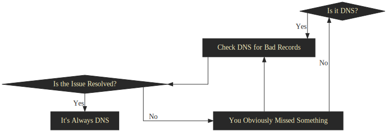
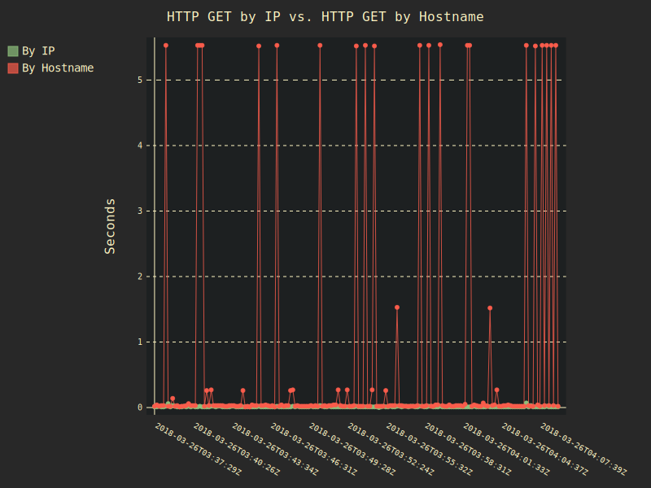
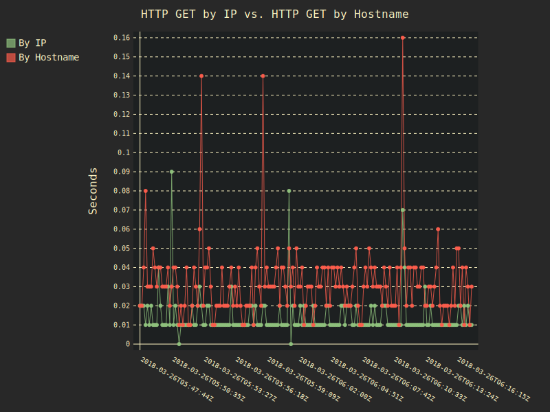
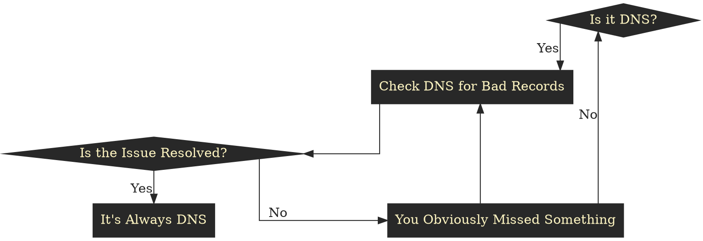

+++
title = "Resolving A DNS Issue"
description = "Resolving my DNS issue."
date = 2018-06-24T13:21:00-07:00
[taxonomies]
tags = ["DNS", "HTTP", "Slow", "Internet"]
+++
Haha. Get it? _Resolving_ a DNS issue. OK, that was bad. You don't have to read
anymore, but I'm `SOA` into this. You might even say I'm in the zone. I think
it's gonna be `A` great read, so consider sticking around, 'cuz there's no
TLD;R.

<!-- more -->

## Symptoms

A few months ago I switched ISPs to try to support a smaller regional ISP
instead of one of the [monopolistic][comcast] [behemoths][warner]. The
transition was largely pain free, but after a little while I noticed that
something wasn't right on the new network. Periodically my web browsing would
be much slower, but it didn't seem to be specific to any particular site.
Furthermore, reloading a site I was having a problem with was usually without
issue.

I let this go on for longer than I'm comfortable admitting, but finally got
fed up when I was trying to `curl` pages from the same site in a loop. I
noticed that the same pages took different amounts of time to fetch between
runs of the loop, which seemed very wrong to me since they were static pages.

## Troubleshooting

My first step in narrowing down the problem was to pick a website known for its
speed and reliability see if I had problems there. I `curl`ed
[google.com][google] in a loop every 10 seconds and sure enough, every
so often the problem would happen there too. The connection would just hang
for a few seconds, but eventually complete.

Next, I wondered how I could narrow it down further to make sure the issue wasn't
caused on my home network. Then I remembered that my gateway could be
accessed by its IP of [192.168.1.1][router-ip] and the hostname
[router.asus.com][asus]. I pointed `curl` at my router's hostname. The same
problem was happening with a domain that resolved to my local network!

OK, so it didn't matter whether I was leaving my network or not. Traffic was
_slooow_ either way. I changed my `curl` loop to point at my router by its IP.
No issues whatsoever. At this point I recalled the age-old sysadmin wisdom.
It's **always** DNS!

<figure>

<figcaption>
It's Always DNS. Converted to SVG from a <a href='https://www.reddit.com/r/sysadmin/comments/34ag51/its_always_dns/'>Reddit post</a> by <a href="https://www.reddit.com/u/tehrabbitt">u/tehrabbitt</a>. <a href='its-always-dns.svg'>View full size.</a>
</figcaption>
</figure>

## Gathering Data

Clearly this was an intermittent DNS issue. I could have gone right into fixing
the problem, but I wanted to know just how bad it was. In order to do that I
needed data. I collected timing information for simultaneous HTTP GET requests
resolving by IP address and by hostname for the same domain over a 2 hour
period with the help of this script.

```zsh
#!/usr/bin/env zsh

# 720 * 10s = 2hrs
: ${INTERVAL=10}
: ${NUM_TESTS=720}

: ${ROUTER_IP="192.168.1.1"}
: ${ROUTER_HOSTNAME="router.asus.com"}

: ${OUTPUT_FILE="./http-test-results.csv"}

function now() {
    # ISO 8601 FTW!
    date -u "+%Y-%m-%dT%H:%M:%SZ"
}

function http-test() {
    local host=$1
    /usr/bin/time -f "%e" curl -s $host > /dev/null
}

function run-tests() {
    # Create CSV header.
    echo "Datetime,Seconds for HTTP GET by IP,Seconds for HTTP GET by Hostname"

    # A sample CSV row will look like
    # 2018-03-26T03:37:29Z,0.01,0.02

    # For each iteration spit out the current time, how long it takes to curl
    # with an IP address, and how long it takes to curl with a hostname.
    for t in {1..${NUM_TESTS}}
    do
        # Redirect stderr to stdout with 2>&1 to capture GNU time's output.
        echo "$(now),$(http-test ${ROUTER_IP} 2>&1),$(http-test ${ROUTER_HOSTNAME} 2>&1)"
        sleep ${INTERVAL}
    done
}

run-tests >> ${OUTPUT_FILE}
```

That was going to give me the data I needed, but reading raw CSVs is a pain.
I don't do graphing very often, but I figured visualization would help, so I
did a quick survey of Python graphing libraries and found the [Pygal][pygal]
library. It turned out to be much more flexible than Matplotlib for my needs
and gave me great looking SVGs customized to match the style of this site.

```python
#!/usr/bin/env python3.6

import sys
from typing import Iterator

import pandas as pd
from pygal import Line
from pygal.style import Style


class GruvboxStyle(Style):
    """ A gruvbox-inspired Pygal style. """

    background = '#282828'
    plot_background = '#1d2021'
    foreground = '#fdf4c1'
    foreground_strong = '#fdf4c1'
    foreground_subtle = '#fdf4c1'
    colors = ('#8ec07c', '#fa5c4b')


def dilute_datetimes(datetimes: pd.Series, factor: int) -> Iterator[str]:
    """ Lots of datetimes overlap and become unreadable, make some space. """
    dilute = lambda t: t[1] if t[0] % factor == 0 else ''
    yield from map(dilute, enumerate(datetimes))


def generate_chart(data: pd.DataFrame) -> Line:
    line_chart = Line(
        js=(),  # The tooltips are really nice, but I don't want any JS.
        style=GruvboxStyle,
        x_label_rotation=30
    )

    # Water those datetimes down so they don't overlap and we can read them!
    datetimes = data['Datetime']
    dilution_factor = datetimes.shape[0] // 10
    datetimes = dilute_datetimes(datetimes, factor=dilution_factor)

    line_chart.title = 'HTTP GET by IP vs. HTTP GET by Hostname'
    line_chart.y_title = 'Seconds'
    line_chart.x_labels = datetimes
    line_chart.add(
        title='By IP',
        values=data['Seconds for HTTP GET by IP']
    )
    line_chart.add(
        title='By Hostname',
        values=data['Seconds for HTTP GET by Hostname']
    )
    return line_chart


def main(argv: list) -> None:
    data = pd.read_csv(sys.argv[1])
    output = sys.argv[2]
    chart = generate_chart(data)
    chart.render_to_file(output)


if __name__ == '__main__':
    main(sys.argv)
```

Now I could run a few simple commands and get a chart to help me understand
what I was dealing with.

```zsh
#!/usr/bin/env zsh
export OUTPUT_FILE=before.csv
zsh http-test.zsh && python3.6 chart.py $OUTPUT_FILE ${OUTPUT_FILE:r}.svg
```

I ended up truncating the results for the graphs below to only show 30 minutes
of the 2 hour data to help readability, but the data looks just about the same
anyway.

<figure>

<figcaption>
HTTP GET by IP vs. HTTP GET by Hostname before the fix. <a href='before.svg'>View full size.</a>
</figcaption>
</figure>

**Wow!** That's _really_ bad. You can't even see the _By IP_ series because
it's dwarfed by these enormous outliers from _By Hostname_. These were local
DNS requests. There's no reason they should have been taking **greater than 5
seconds** to
complete.

## Resolution

I logged into my router's administrative console and sure enough, right there
in the logs was a DNS error.

```
Mar 25 21:44:03 dnsmasq[31700]: nameserver 208.76.152.1 refused to do a recursive query
```

I was still using the default upstream DNS given by my ISP and it was refusing
[recursive DNS queries][recursive-dns]. My OS wasn't running a caching DNS
resolver locally, so I was totally at the mercy of my router. When the router
went out to lunch trying to satisfy a DNS request my connections did too.

Curiously, only one of the two nameservers my router was configured to use
appeared in the logs with that error message. Not knowing exactly how the
router manufacturer configured DNSMasq or how the upstream DNS servers were
configured my working hypothesis is that the one refusing recursive queries
was the primary and requests that weren't cached always had to go to two
servers.

My assumption is that DNSMasq is pretty badly misconfigured on my router as I
wouldn't expect [router.asus.com][asus] to even need a recursive query.
Ultimately I should probably run my own local DNS. Maybe I'll even take
[trust-dns] for a spin. That would be a long-term project though, so I opted
instead to simply change my nameservers to [Google's public ones][google-dns].
The problem finally went away once recursive queries were being supported!

## Measuring Success

Once I was confident I'd fixed the problem I ran the same chart generation
commands as before, being careful to set `OUTPUT_FILE="after.csv"` so as not to
overwrite my previous data.

<figure>

<figcaption>
HTTP GET by IP vs. HTTP GET by Hostname after the fix. <a href='after.svg'>View full size.</a>
</figcaption>
</figure>

Much better! Even the most extreme request was under two tenths of a second.
Just how much did the situation improve though? I wrote one last script to find
out.

```zsh
#!/usr/bin/env zsh
function percent_failures() {
    local file="${1}"
    local pattern="${2}"
    local num_failures=$(grep $pattern $file | wc -l)
    local num_results=$(wc -l $file | cut -d\  -f1)
    echo "scale=4; ${num_failures} / ${num_results} * 100" | bc -l
}

percent_failures before.csv '5\.'
percent_failures after.csv '5\.'
```

Prior to fixing the issue 11.66% of all requests took longer than 5 seconds.
After applying the fix that dropped to 0.13%. I'd say that's a noticeable
improvement!

#### Bonus

In case you were curious about how the [_It's Always DNS_][its-always-dns]
diagram above was generated, here's the [Graphviz][graphviz] source and `dot`
command to reproduce it.



```zsh
#!/usr/bin/env zsh
dot -Tsvg its-always-dns.dot -o its-always-dns.svg
```

In the interest of making this post maximally reproducible I've put all the
raw data and scripts used in this post in a
[GitHub repo][resolving-a-dns-issue] for anyone who wants to play with them
on their own network.

[comcast]: https://en.wikipedia.org/wiki/Comcast
[warner]: https://en.wikipedia.org/wiki/WarnerMedia
[google]: https://google.com/
[router-ip]: https://192.168.1.1
[asus]: https://router.asus.com
[graphviz]: https://www.graphviz.org/
[pygal]: https://github.com/Kozea/pygal
[recursive-dns]: https://unix.stackexchange.com/a/24391/82338
[trust-dns]: https://github.com/bluejekyll/trust-dns
[google-dns]: https://developers.google.com/speed/public-dns/
[its-always-dns]: its-always-dns.svg
[resolving-a-dns-issue]: https://github.com/reillysiemens/resolving-a-dns-issue
